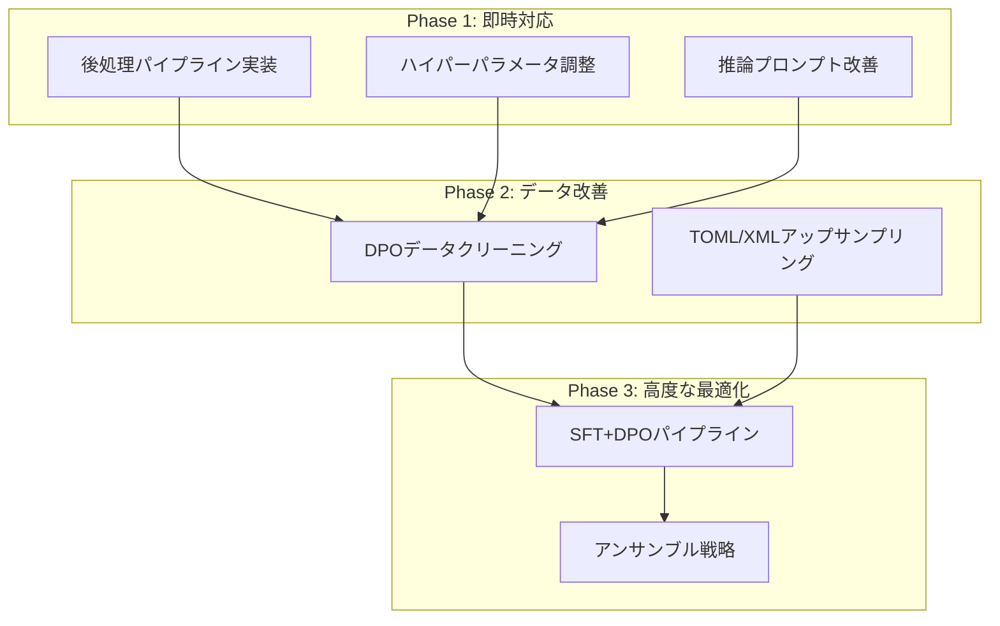

# DPO v1 精度向上のための包括的改善プラン

## 1. 現状分析サマリー

### 1.1 現在のスコアと主要メトリクス

| メトリクス | 値 |
|-----------|-----|
| **LBスコア** | 0.701763 |
| **ローカル評価** | 61.33% (92/150) |
| **学習ステップ数** | 500 |
| **最終Training Loss** | 0.582500 |
| **rewards/accuracies** | 0.877500 |
| **rewards/margins** | 0.249355 |

### 1.2 フォーマット別精度（ローカル評価）

```
フォーマット   精度      件数       状況
━━━━━━━━━━━━━━━━━━━━━━━━━━━━━━━━━━━━━━━━━━
CSV           100.0%    20/20     ✅ 問題なし
YAML           74.3%    26/35     △ 中程度
JSON           66.0%    33/50     △ 中程度（要改善）
XML            30.0%     6/20     ✗ 重大な問題
TOML           28.0%     7/25     ✗ 重大な問題
━━━━━━━━━━━━━━━━━━━━━━━━━━━━━━━━━━━━━━━━━━
OVERALL        61.33%   92/150
```

### 1.3 学習曲線の洞察

```
- rewards/margins: 0.001 → 0.249（順調に増加）
- rewards/accuracies: 0.48 → 0.877（高い識別精度）
- Training Loss: 0.696 → 0.582（健全な低下）
```

**観察**: 学習は順調に進行しているが、推論時の出力形式に問題が残る。

---

## 2. 問題点の特定（優先度付き）

### 🔴 問題1: 説明文付き出力（最重要・影響度: 高）

**現象**: DPOモデルが「Sure! Here's...」のような説明文と`\`\`\`json`などのマークダウンコードブロックを出力している。

**エビデンス**:
- JSON エラー17件中16件が「Expecting value: line 1 column 1」
- 全XML エラー14件が「not well-formed (invalid token): line 1, column 4」
- 出力例: `"Sure! Here's the CSV data converted into JSON format:\n\n\`\`\`json\n..."`

**根本原因分析**:
1. DPO学習データのchosenは生フォーマット出力だが、ベースモデルの「説明付き回答」傾向を完全に修正できていない
2. Conversion（変換）タスクで特に顕著
3. ベースモデル（Qwen3-4B-Instruct）の指示追従性が強すぎる

### 🔴 問題2: TOML構文エラー（優先度: 高）

**現象**: TOMLの精度が28%と壊滅的

**エラーパターン分析**:
| エラータイプ | 件数 | 原因 |
|-------------|------|------|
| Key name found without value | 10件 | インラインテーブル形式の誤用 |
| dict has no attribute append | 6件 | 配列構文の誤り |
| could not convert string to float | 1件 | 型変換エラー |

**コード例**:
```toml
# エラー出力例
location = {
    planet = "Zephyra-9"  # ← カンマなしで改行 = エラー
    region = "N..."
```

### 🔴 問題3: XML構文エラー（優先度: 高）

**現象**: XMLの精度が30%

**共通エラー**: 全て「not well-formed (invalid token): line 1, column 4」
- 原因: 出力が「Sure!」から始まっており、XMLとしてパースできない

### 🟡 問題4: YAML構文エラー（優先度: 中）

**エラーパターン**:
| エラータイプ | 件数 |
|-------------|------|
| `\`\`\`yaml` によるパースエラー | 6件 |
| mapping values構文エラー | 3件 |

### 🟢 問題5: JSON構文エラー（優先度: 中）

**エラーパターン**:
| エラータイプ | 件数 |
|-------------|------|
| 説明文 + コードブロック | 16件 |
| Extra data | 1件 |

---

## 3. SFT vs DPO 比較分析

### 推論出力の比較

| 特徴 | SFT v5 | DPO |
|------|--------|-----|
| 生JSON出力 | ほとんどの場合 | 一部のみ |
| 説明文付き | 一部（複雑なCSV変換時） | 多数（特にConversion） |
| コードブロック | 稀 | 頻繁 |
| TOML/XML対応 | 不明（要検証） | 弱い |

### 重要な発見

**SFT v5** (task_id: p_bb8bcd0930ae9f9e4f0692ae):
```json
"generation": "{\n  \"name\": \"Star Voyager\",\n  \"model\": \"XJ-9\"..."
```

**DPO** (同じtask_id):
```
"generation": "Sure! Here's the CSV data converted into JSON format:\n\n\`\`\`json\n[\n  {\n    \"name\": \"Star Voyager\"..."
```

→ **DPOがベースモデルの「親切な説明」挙動を修正できていない**

---

## 4. DPOデータセット品質分析

### 4.1 chosen vs rejected の特徴

| 特性 | chosen | rejected |
|------|--------|----------|
| 出力形式 | 生フォーマット（コードブロックなし） | マークダウンコードブロック付き |
| Approach部 | 短い（8件のみ長い） | 長い（4032件） |
| Output部 | 中程度 | 若干長い |

### 4.2 Person I の発見（他メンバー情報）

> chosenの方が長かったケース：249件
> rejectedの方が長かったケース：3791件

**→ 長さの偏りが大きく、モデルが「短い=良い」と学習している可能性**

### 4.3 データ品質問題

- **XMLデータの問題**: Person D によると、prompt/chosenでXML構造が壊れているデータが存在
  - prompt壊れ: 34件
  - chosen壊れ: 59件

---

## 5. 改善策の提案

### 📌 短期改善（すぐ実装可能）

#### A. 後処理パイプラインの導入

```python
def clean_output(text: str, format_type: str) -> str:
    # 1. 説明文の除去
    if text.startswith(('Sure!', 'Here', 'Let me', 'I will')):
        # "Output:" または実際のデータ開始位置を検出
        patterns = ['\n\`\`\`', '\n{', '\n[', '\n<', '\nopenapi']
        for pattern in patterns:
            if pattern in text:
                text = text[text.index(pattern)+1:]
                break

    # 2. コードブロックの除去
    text = re.sub(r'^\`\`\`\w*\n?', '', text)
    text = re.sub(r'\n?\`\`\`$', '', text)

    # 3. フォーマット固有のクリーニング
    if format_type == 'TOML':
        text = fix_toml_inline_tables(text)

    return text.strip()
```

**期待効果**: JSON/XML/YAMLのエラー大幅削減（推定+15-20%改善）

#### B. ハイパーパラメータ調整

現在の設定:
```python
LEARNING_RATE = 1e-7      # 非常に小さい
BETA = 0.1                # 標準的
NUM_TRAIN_EPOCHS = 1      # 少ない
MAX_LENGTH = 1024         # 標準的
```

**推奨変更**:
```python
LEARNING_RATE = 5e-7      # やや増加（より強い学習）
BETA = 0.05               # 減少（好みの差をより強調）
NUM_TRAIN_EPOCHS = 2      # 増加
WARMUP_RATIO = 0.05       # 減少（早めに本学習）
```

#### C. 推論プロンプトの改善

現在のシステムプロンプト:
```
You are a helpful assistant. Please format your response as follows:
Approach: <step-by-step reasoning>
Output: <final answer>
```

**推奨変更**:
```
You are a data format converter. Output ONLY the requested format.
Do NOT include explanations, markdown code fences, or any text before the output.
Start your response with the actual data structure immediately.
```

### 📌 中期改善（データ修正が必要）

#### D. DPOデータセットのクリーニング

1. **XML壊れデータの除去**（93件）
2. **長さバランスの調整**
   - chosenのApproach部を短縮
   - またはrejectedのApproach部も短縮してバランス改善
3. **Conversion タスクの強化**
   - 説明文なしのchosenサンプルを増強

#### E. フォーマット別データ拡張（TOML/XMLの強化）

```python
# アップサンプリングルール
os.environ["SFT_UPSAMPLE_RULES"] = '{"toml": 3.0, "xml": 2.5}'
```

### 📌 長期改善（実験的）

#### F. SFT + DPO パイプラインの最適化

Person H の発見:
> SFT単独で0.82、DPO単独で0.76 → SFT+DPOで0.73に低下

**推奨アプローチ**:
1. SFTで高精度モデルを作成
2. DPOは**conservative**に適用（epochs=1, lr=1e-8）
3. または**DPOをTOML/XML特化**で適用

#### G. アンサンブル戦略

```
フォーマット   使用モデル
━━━━━━━━━━━━━━━━━━━━━━━━━━
CSV           SFT（100%精度）
JSON          SFT or DPO
YAML          SFT or DPO
TOML          SFT（DPOより良好な可能性）
XML           SFT（DPOより良好な可能性）
```

---

## 6. 期待効果

| 改善策 | 実装難易度 | 期待効果 |
|--------|-----------|----------|
| A. 後処理パイプライン | 低 | +10-15% |
| B. ハイパーパラメータ調整 | 低 | +3-5% |
| C. 推論プロンプト改善 | 低 | +5-10% |
| D. データクリーニング | 中 | +5-8% |
| E. フォーマット別拡張 | 中 | +3-5% |
| F. SFT+DPO最適化 | 高 | +10-15% |
| G. アンサンブル | 高 | +5-10% |

**目標スコア**:
- 短期（A+B+C）: 0.70 → 0.78-0.82
- 中期（+D+E）: 0.82 → 0.85+
- 長期（+F+G）: 0.85+ → 0.90+

---

## 7. 実装優先順位とロードマップ



### Phase 1: 即時対応（1-2日）

1. **後処理スクリプト作成**
   - 説明文除去
   - コードブロック除去
   - フォーマット固有修正

2. **ハイパーパラメータ実験**
   - learning_rate: 1e-7 → 5e-7
   - beta: 0.1 → 0.05
   - epochs: 1 → 2

3. **推論プロンプト変更**
   - システムプロンプト簡素化
   - 「コードのみ出力」を強調

### Phase 2: データ改善（3-5日）

1. **DPOデータセット修正**
   - XML壊れデータ除去スクリプト作成
   - 長さバランス分析・調整

2. **フォーマット別強化**
   - TOML/XMLのアップサンプリング
   - Conversionタスクの品質向上

### Phase 3: 高度な最適化（1週間+）

1. **SFT+DPO最適化**
   - SFTモデルベースでDPO微調整
   - Conservative DPO設定の検証

2. **アンサンブル実装**
   - フォーマット別最適モデル選択
   - 推論パイプライン構築

---

## 8. 次のアクション

### 即座に実施すべき項目

- [ ] 後処理スクリプトの実装と検証
- [ ] 推論プロンプト変更でのベースライン再評価
- [ ] learning_rate=5e-7, beta=0.05 での再学習
- [ ] SFT v5 との詳細比較（フォーマット別）

### 検証が必要な項目

- [ ] SFT v5のTOML/XML精度確認
- [ ] DPOデータセットのXML壊れサンプル特定
- [ ] 後処理でどこまでスコア改善するか測定

---

## 9. 参考: 他メンバーからの重要な知見

1. **Person B**: 過学習すると「フォーマットは守るが内容を理解できなくなる」
2. **Person C/D**: XMLデータに構文エラーが含まれている
3. **Person E**: TOML/XMLが全体のボトルネック
4. **Person F**: StructEval論文では「オープン系LLMはTOML生成が壊滅的」
5. **Person G**: 余計な前置きとコードフェンスが主なエラー原因
6. **Person I**: chosen/rejected の長さバランスに大きな偏りがある
7. **Person L**: TOMLアップサンプリングで56%→70%に改善

---

## 10. 結論

DPO精度向上の最大のボトルネックは**「説明文付き出力」問題**である。これは：

1. **後処理**で即座に対応可能
2. **プロンプト改善**で軽減可能
3. **DPOデータ品質向上**で根本解決可能

TOML/XMLの低精度は：
1. フォーマット固有の構文問題
2. 学習データの品質問題
3. アップサンプリングで改善可能

短期的には後処理とハイパーパラメータ調整で**0.78-0.82**を目指し、中長期的にはデータ改善とアンサンブルで**0.85+**を目指す戦略が現実的である。
