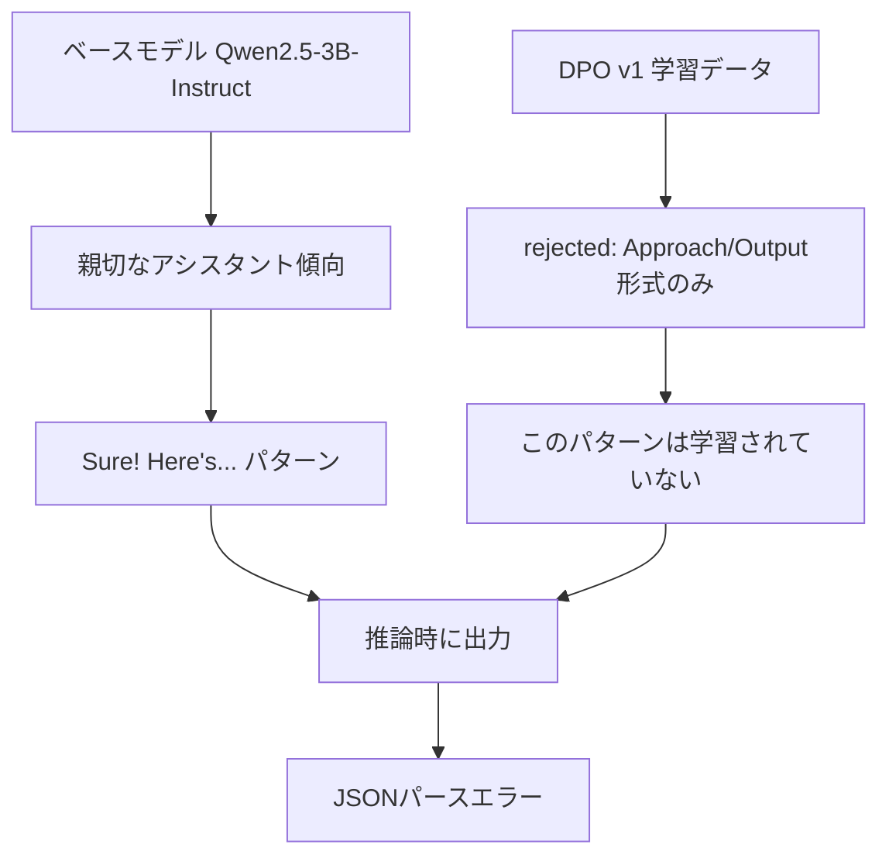
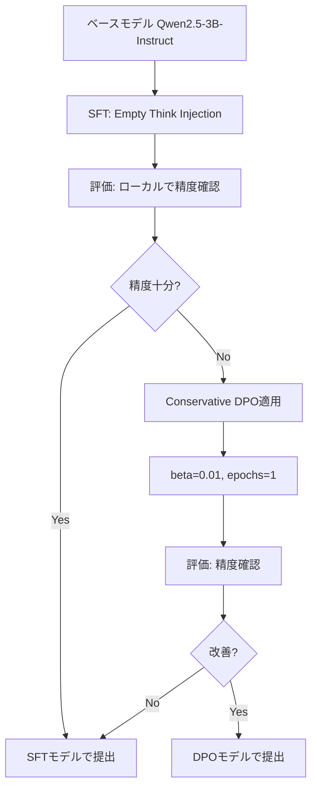

# DPO v2 戦略 - 後処理禁止を前提とした改善アプローチ

## 重要な制約

> **運営からのコメント:**
> 「本コンペの趣旨は、StructEval－T に準じたベンチマークにおいて高得点を出せるモデルそのものを、学習（SFT／DPO等）によって作り上げる点にあります。そのため、正規表現やルールベース処理など、LLMの推論能力に依存しない後処理によって出力形式を整えることは、本来の趣旨とは異なります。」

**⚠️ 後処理は使用禁止。モデル自体が正しいフォーマットで出力できるよう学習させる必要があります。**

---

## 1. 問題の根本原因分析

### 1.1 DPO v1 の推論結果分析

DPO v1の推論結果（`outputs/inference_dpo_v1.json`）を詳細に分析した結果：

**ローカル評価結果（後処理なし）:**

| フォーマット | 精度 |
|-------------|------|
| CSV | 100.0% |
| JSON | 66.0% |
| XML | 35.0% |
| YAML | 74.3% |
| TOML | 28.0% |
| **全体** | **62.0%** |

### 1.2 出力パターンの分類

**成功パターン（純粋なコード出力）:**
- 生成タスク（Create a JSON...）で多く見られる
- 例: `"{\n  \"ecosystem\": {\n  \"name\": \"Verdant Vale...\"}"`

**失敗パターン（説明文+コードブロック）:**
- 変換タスク（CSV→JSON等）で多発
- パターン例:
  - `"Sure! Here's the CSV data converted into JSON format:\n\n```json\n[...]\n```"`
  - `"Here is the provided...:\n\n```format\n...```"`
  - 末尾: `"### Notes:\n- ...\n\nLet me know if you'd like..."`

### 1.3 根本原因の特定



**核心問題:**
1. **DPO v1のrejectedパターンが限定的**
   - 学習データ: `"Approach:\n...\nOutput:\n```format```"` 形式のみ
   - 推論出力: `"Sure! Here's..."` 形式 ← **カバーされていない**

2. **ベースモデルの傾向**
   - Qwen2.5-3B-Instructは「親切なアシスタント」として設計
   - 自然と説明文を追加する傾向がある

3. **DPOの限界**
   - パターン固有の回避は学習できる
   - 「説明文を出力しない」という概念一般の学習は困難

---

## 2. 学習データのさらなる改善策

### 2.1 rejectedパターンの多様化 🔴 最重要

現在のrejectedは「Approach/Output」形式のみ。以下のパターンを追加：

**追加すべきrejectedパターン:**

```python
REJECTED_PATTERNS = [
    # 1. 前置き文パターン
    "Sure! Here's the {format} data:\n\n```{format}\n{content}\n```",
    "Here is the converted data:\n\n```{format}\n{content}\n```",
    "Below is the {format} representation:\n\n```{format}\n{content}\n```",
    "The following is the data in {format} format:\n\n```{format}\n{content}\n```",

    # 2. コードブロックのみパターン
    "```{format}\n{content}\n```",

    # 3. 末尾注釈パターン
    "{content}\n\n### Notes:\n- This is a valid {format}...",
    "{content}\n\nLet me know if you'd like it formatted differently...",
    "{content}\n\n✅ This {format} is valid and structured...",

    # 4. 複合パターン（最も問題となる）
    "Sure! Here's...\n\n```{format}\n{content}\n```\n\n### Notes:\n...\n\nLet me know if..."
]
```

**実装方針:**
```python
def create_diverse_rejected(chosen_content, format_type):
    """多様なrejectedパターンを生成"""
    patterns = [
        f"Sure! Here's the {format_type} data:\n\n```{format_type}\n{chosen_content}\n```",
        f"Here is the converted data:\n\n```{format_type}\n{chosen_content}\n```",
        f"```{format_type}\n{chosen_content}\n```",
        f"{chosen_content}\n\nLet me know if you'd like it formatted differently!",
    ]
    return random.choice(patterns)
```

### 2.2 chosenの純粋化

現在のchosenは純粋なコードだが、以下を確認・強化：

- **先頭の空白・改行を除去**
- **末尾の余分なテキストを除去**
- **コードブロックマーカーの完全除去**

### 2.3 長さバランスの調整 🟡 重要

**Person Iの発見:**
- chosenが長い: 249件
- rejectedが長い: 3791件
- この偏りで「短い=良い」と誤学習

**対策:**
1. rejectedを短縮（Approach部の削減）
2. または、chosenを意図的に長くする（複数レコードの追加）
3. 長さの分布を均一化

---

## 3. SFT + Empty Think Injection 🌟 推奨アプローチ

### 3.1 Person Rの手法（LB 0.7228達成）

**最大のポイント: Empty Think Injection**

Qwen3はデフォルトで `<think>...</think>` の思考出力を生成。構造化データ出力タスクでは、このthinking内でコードフェンスや前置き文が混入し、パースエラーの原因に。

**解決策:**
```
<think>
</think>

{生の構造化データ}
```

### 3.2 実装手順

```python
import re

def clean_assistant_content(content: str) -> str:
    """SFTデータのassistant出力をクリーンに"""
    # 1. CoT部分（Approach: ... Output: ...）を削除
    content = re.sub(r'^Approach:.*?Output:\s*', '', content, flags=re.DOTALL)

    # 2. コードフェンスを削除
    content = re.sub(r'```\w*\n?', '', content)
    content = re.sub(r'```$', '', content)

    # 3. 前置き文を削除
    content = re.sub(r'^(Sure!|Here\'s|Here is|Below is).*?:\s*\n+', '', content, flags=re.IGNORECASE)

    # 4. 末尾の注釈を削除
    content = re.sub(r'\n\n(###?\s*Notes?:.*|Let me know.*|This.*valid.*)$', '', content, flags=re.DOTALL | re.IGNORECASE)

    # 5. Empty Think Injectionを追加
    clean_content = f"<think>\n</think>\n\n{content.strip()}"

    return clean_content
```

### 3.3 SFTデータの変換

現在のSFTデータ（`inputs/sft_processed/v5/train.json`）を確認すると、**CoT形式が残っている**：

```json
{
  "role": "assistant",
  "content": "Approach:\n1. Task: Convert...\n\nOutput:\n{actual_data}"
}
```

これを以下に変換：

```json
{
  "role": "assistant",
  "content": "<think>\n</think>\n\n{actual_data}"
}
```

---

## 4. ハイパーパラメータの再検討

### 4.1 DPO設定の変更案

**現在のDPO v1設定:**
```python
DPOConfig(
    learning_rate=5e-7,
    beta=0.05,
    num_train_epochs=2,
    loss_type="sigmoid",  # デフォルト
)
```

**推奨変更:**

```python
DPOConfig(
    learning_rate=5e-7,
    beta=0.1,           # より強い嗜好学習（0.05→0.1）
    num_train_epochs=3, # エポック増加
    loss_type="ipo",    # IPO損失関数（勾配消失対策）
)
```

### 4.2 IPO Loss Type の効果

**Person Oの知見:**
- DPOのsigmoid損失は、chosen/rejectedの差が大きいと勾配消失
- IPOで対応可能

```python
# DPOConfigに追加するだけ
loss_type="ipo"
```

### 4.3 その他の検討事項

**CPO (Contrastive Preference Optimization):**
```python
from trl import CPOTrainer, CPOConfig

cpo_config = CPOConfig(
    learning_rate=5e-7,
    loss_type="simpo",  # 長さ正規化
    ...
)
```

**SimPO Loss Type:**
- 長い文章が不利にならないよう正規化
- 現在の長さバランス問題に効果的

---

## 5. SFT→DPO パイプラインの注意点

### 5.1 Person Hの警告

**結果:**
- SFT単独: 0.82
- DPO単独: 0.76
- **SFT+DPO: 0.73** （大幅低下）

**教訓:** 単純にSFT+DPOを組み合わせるとスコアが下がる可能性がある

### 5.2 推奨アプローチ



**Conservative DPO:**
- beta値を小さく（0.01〜0.03）
- エポック数を少なく（1）
- SFTで学習した内容を壊さないよう慎重に

---

## 6. 実装優先順位と期待効果

### 6.1 優先順位

| 優先度 | 施策 | 期待効果 | 実装難易度 |
|-------|------|---------|-----------|
| 🔴 1 | SFT + Empty Think Injection | +0.10〜0.15 | 低 |
| 🔴 2 | DPOデータ: rejectedパターン多様化 | +0.05〜0.10 | 中 |
| 🟡 3 | IPO loss typeの適用 | +0.02〜0.05 | 低 |
| 🟡 4 | 長さバランスの調整 | +0.02〜0.03 | 中 |
| 🟢 5 | Conservative SFT→DPO | +0.01〜0.03 | 高 |

### 6.2 期待されるスコア推移

| 施策 | 現状 | 期待スコア |
|------|------|-----------|
| DPO v1（後処理なし） | 0.62 | - |
| + rejectedパターン多様化 | - | 0.68〜0.72 |
| + IPO loss type | - | 0.70〜0.74 |
| SFT + Empty Think Injection | - | 0.72〜0.78 |
| + Conservative DPO | - | 0.74〜0.80 |

---

## 7. 具体的な実装計画

### Phase 1: SFT改善（最優先）

**7.1.1 Empty Think InjectionをSFTデータに適用**

```python
# scripts/create_sft_v6_empty_think.py

import json
import re

def process_sft_data(input_path, output_path):
    with open(input_path, 'r') as f:
        data = json.load(f)

    for item in data:
        for msg in item['messages']:
            if msg['role'] == 'assistant':
                content = msg['content']
                # CoT除去 + Empty Think Injection
                content = clean_assistant_content(content)
                msg['content'] = content

    with open(output_path, 'w') as f:
        json.dump(data, f, indent=2, ensure_ascii=False)
```

**7.1.2 SFT v6の学習**

```python
# 推奨設定
SFT_CONFIG = {
    'learning_rate': 5e-5,
    'num_train_epochs': 2,
    'per_device_train_batch_size': 16,
    'max_seq_length': 1024,
}
```

### Phase 2: DPOデータ改善

**7.2.1 rejectedパターンの多様化**

```python
# scripts/improve_dpo_dataset_v2.py

import json
import random

def create_diverse_rejected(chosen_content, format_type):
    patterns = [
        f"Sure! Here's the {format_type} data:\n\n```{format_type}\n{chosen_content}\n```\n\nLet me know if you need any changes!",
        f"Here is the converted data in {format_type} format:\n\n```{format_type}\n{chosen_content}\n```",
        f"```{format_type}\n{chosen_content}\n```\n\n### Notes:\n- This is a properly formatted {format_type}",
        f"Below is the {format_type} representation:\n\n{chosen_content}\n\n✅ Valid {format_type}!",
    ]
    return random.choice(patterns)

def process_dpo_data(input_path, output_path):
    with open(input_path, 'r') as f:
        data = json.load(f)

    for item in data:
        # chosen: 純粋なコードのみに
        item['chosen'] = clean_code(item['chosen'])

        # rejected: 多様なパターンに
        format_type = detect_format(item['prompt'])
        item['rejected'] = create_diverse_rejected(item['chosen'], format_type)

    with open(output_path, 'w') as f:
        json.dump(data, f, indent=2, ensure_ascii=False)
```

### Phase 3: DPO v2 学習

**7.3.1 DPO設定**

```python
DPO_V2_CONFIG = {
    'learning_rate': 5e-7,
    'beta': 0.1,
    'num_train_epochs': 2,
    'loss_type': 'ipo',
    'per_device_train_batch_size': 4,
}
```

---

## 8. 検証計画

### 8.1 ローカル評価

```python
# scripts/local_eval.py を使用
# 各施策適用後にローカル評価を実行

python scripts/local_eval.py \
    --inference_file outputs/inference_sft_v6.json \
    --ground_truth test_data/public_150.json
```

### 8.2 評価指標

- **パース成功率（PSR）**: フォーマット別に計測
- **全体精度**: 150問中の正解数

### 8.3 アブレーション実験

| 実験 | 変更点 | 目的 |
|------|--------|------|
| A | Empty Think Injectionのみ | 基本効果の確認 |
| B | A + rejectedパターン多様化 | DPO改善効果の確認 |
| C | A + B + IPO loss type | 損失関数の効果確認 |
| D | A + B + C + Conservative DPO | 組み合わせ効果の確認 |

---

## 9. まとめ

### 後処理禁止を前提とした改善の核心

1. **モデルが「純粋なコードのみ」を出力するよう学習させる**
   - SFT: Empty Think Injection
   - DPO: 多様なrejectedパターンで「説明文を出さない」を学習

2. **ベースモデルの傾向を理解し対処**
   - Qwen3の `<think>` 機能を逆利用
   - 空のthinkブロックで即座に構造化データ出力へ

3. **DPOの限界を認識**
   - 単純なDPOでは「概念一般」の学習は困難
   - 具体的なパターンをrejectedに網羅する必要あり

### 最優先アクション

1. **SFT v6: Empty Think Injection の実装と学習**
2. **DPO v2: rejectedパターン多様化 + IPO loss type**
3. **ローカル評価で効果確認後、提出**

---

## 10. 参考リンク

- Person R の公開モデル: https://huggingface.co/beachcities/qwen3-4b-sft-v5g-hybrid-merged
- TRL DPO Trainer: https://huggingface.co/docs/trl/dpo_trainer
- IPO Loss Functions: https://huggingface.co/docs/trl/dpo_trainer#loss-functions
