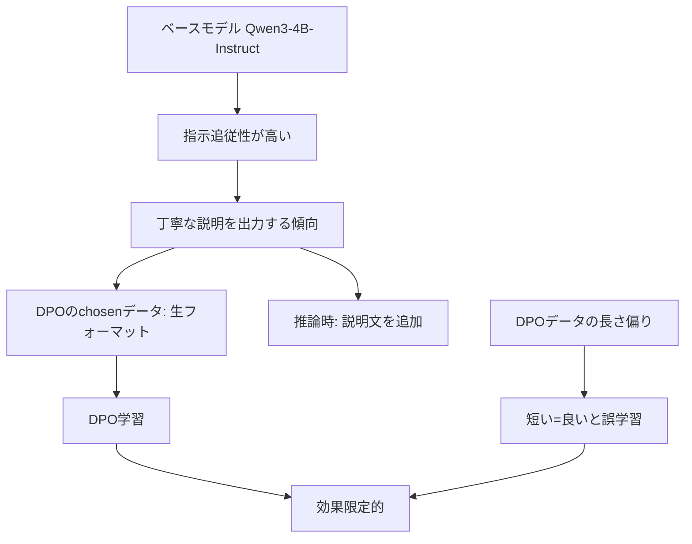

# DPO v2 戦略分析 - v1結果を踏まえた改善方針

## 1. DPO v1 結果サマリー

### スコア推移

| バージョン | LBスコア | 変化 |
|-----------|----------|------|
| DPO v0 | 0.701763 | - |
| DPO v1 | 0.70663 | **+0.005** |

### v1での変更点
- `learning_rate`: 1e-7 → 5e-7
- `beta`: 0.1 → 0.05
- `num_train_epochs`: 1 → 2
- 改善版DPOデータの使用

### v1の結果分析

**改善が見られた点:**
- わずかなスコア向上（+0.005）

**依然として残る問題:**
1. **説明文付き出力**: `"Sure! Here's..."` がCSV→JSON変換で多発
2. **コードブロック**: ` ```json ` などが含まれる
3. **末尾の注釈**: `"Notes:"`, `"Let me know if..."` など
4. **長い説明**: 変換方法の詳細な解説

**推論出力例（問題あり）:**
```
"Sure! Here's the CSV data converted into JSON format:\n\n```json\n[...]\n```\n\nThis is a valid JSON array..."
```

**推論出力例（良好）:**
```
"{\n  \"ecosystem\": {\n    \"name\": \"Verdant Vale...\"}"
```

→ タスクによって出力品質にばらつきがある

---

## 2. 他メンバーからの重要な知見（DPO関連）

### 2.1 Person I: DPOデータの長さバランス問題 🔴 重要

> **発見**: chosen vs rejected の長さに大きな偏りがある
> - chosenの方が長い: 249件
> - rejectedの方が長い: **3791件**
> - Approach部の偏り: chosenが長い: 8件, rejectedが長い: **4032件**

**影響**: モデルが「短い=良い」と誤学習している可能性

**Person Iの結果**: 偏りを緩和することで **0.71 → 0.73** にスコアアップ

### 2.2 Person H: SFT+DPOの問題 ⚠️ 警告

> - SFT単独: 0.82
> - DPO単独: 0.76
> - **SFT+DPO: 0.73** （大幅低下）

**教訓**: 単純にSFT+DPOを組み合わせるとスコアが下がる可能性がある

### 2.3 Person O: DPO代替手法 💡 新しいアプローチ

**1. IPO loss type（勾配消失対策）**
```python
loss_type="ipo"
```
- DPOのsigmoid損失は、chosen/rejectedの差が大きいと勾配消失
- IPOで対応可能

**2. CPO (Contrastive Preference Optimization)**
```python
from trl import CPOTrainer, CPOConfig
```
- 「正しいだけでなく完璧な出力」を学習
- DPOからの変更は簡単

**3. SimPO loss type（長さ正規化）**
```python
loss_type="simpo"
```
- 長い文章が不利にならないよう正規化

### 2.4 Person R: SFTだけで0.7228達成 🌟 重要

**Empty Think Injection手法:**
```
<think>
</think>

{生の構造化データ}
```

- 元データのCoT（Approach部）を物理削除
- 空の `<think>` ブロックを先頭に付与
- コードフェンス・前置き文・後書きを正規表現で除去

**結果**: SFTのみで **LB 0.7228** を達成

### 2.5 Person P: パラメータ最適化の凸構造

> 「ある一つのパラメータを変えていくと分析結果が凸になることがわかりました」

**教訓**: パラメータ空間には最適点があり、系統的な探索が有効

---

## 3. 問題の根本原因分析

### DPOが効きにくい理由



### 主要な課題

| 課題 | 原因 | 影響度 |
|------|------|--------|
| 説明文付き出力 | ベースモデルの傾向 + DPO効果不足 | 🔴 高 |
| コードブロック | 同上 | 🔴 高 |
| 長さバランス問題 | DPOデータの偏り | 🟡 中 |
| TOML/XML精度 | フォーマット固有の難しさ | 🟡 中 |

---

## 4. 改善戦略の選択肢

### Option A: DPOデータの大幅改善

**アプローチ:**
1. 長さバランスの調整（Person Iの手法）
2. Approach部の短縮/統一
3. より多様なConversionサンプルの追加

**期待効果:** +0.02〜0.03（0.73程度）

**リスク:** データ改善だけでは限界がある可能性

### Option B: 代替手法の採用

**アプローチ:**
1. IPO loss type に変更
2. または CPO に移行
3. SimPO で長さ正規化

**期待効果:** +0.02〜0.05

**リスク:** ハイパーパラメータの再調整が必要

### Option C: SFT優先戦略 🌟 推奨

**アプローチ:**
1. Person Rの Empty Think Injection を SFT に適用
2. SFT で高精度モデルを作成
3. 必要に応じて conservative DPO を追加適用

**期待効果:** 0.72〜0.80+

**理由:**
- Person R の実績（0.7228）
- SFT の方が出力形式の制御が容易
- DPO の問題（長さ偏り、効果限定的）を回避

### Option D: 後処理パイプライン

**アプローチ:**
1. 説明文の自動除去
2. コードブロックの除去
3. フォーマット固有の修正

**期待効果:** +0.05〜0.10（即効性あり）

**実装例:**
```python
def clean_output(text, format_type):
    # 1. 説明文の除去
    patterns = [
        r'^Sure!.*?:\s*\n',
        r'^Here\'s.*?:\s*\n',
        r'^Let me.*?:\s*\n',
    ]
    for p in patterns:
        text = re.sub(p, '', text, flags=re.IGNORECASE)

    # 2. コードブロックの除去
    text = re.sub(r'```\w*\n?', '', text)
    text = re.sub(r'```$', '', text)

    # 3. 末尾の注釈除去
    text = re.sub(r'\n\n(Notes?:.*|Let me know.*|This.*valid.*)$', '', text, flags=re.DOTALL)

    return text.strip()
```

---

## 5. 推奨する戦略

### 短期（即時実行）: Option D + Option B

1. **後処理パイプラインの実装**
   - 既存の推論結果に適用可能
   - 即座にスコア向上が期待できる

2. **IPO loss type への変更**
   - DPOConfig に `loss_type="ipo"` を追加するだけ
   - 勾配消失問題を解決

### 中期: Option A + Option C

1. **DPOデータの長さバランス調整**
   - Person I の手法を参考に
   - chosen/rejected の長さ偏りを緩和

2. **SFT + Empty Think Injection**
   - SFT データに空の `<think>` ブロックを追加
   - クリーンな出力を学習

### 長期: アンサンブル

1. **フォーマット別最適モデル選択**
   - CSV: SFT（高精度）
   - JSON/YAML: DPO または SFT
   - TOML/XML: SFT（DPO は苦手）

---

## 6. 次のアクション（優先順位付き）

### 🔴 最優先（今すぐ実行）

1. **後処理スクリプトの作成と検証**
   - DPO v1 の推論結果に適用
   - ローカル評価でスコア改善を確認

2. **IPO loss type での DPO v2 学習**
   ```python
   dpo_config = DPOConfig(
       loss_type="ipo",  # 追加
       learning_rate=5e-7,
       beta=0.05,
       num_train_epochs=2,
       ...
   )
   ```

### 🟡 中優先（次のステップ）

3. **DPOデータの長さバランス調整**
   - Approach部の長さを揃える
   - chosen/rejected の偏りを緩和

4. **SFT に Empty Think Injection を適用**
   - Person R の手法を実装
   - SFT v6 として学習

### 🟢 検討事項

5. **CPO への移行検討**
   - DPO より効果的な可能性
   - 実験的に試す価値あり

6. **アンサンブル戦略の設計**
   - フォーマット別に最適モデルを選択

---

## 7. 期待されるスコア推移

| 戦略 | 期待スコア | 根拠 |
|------|-----------|------|
| 現状（DPO v1） | 0.706 | 実績 |
| + 後処理パイプライン | 0.72〜0.75 | エラー削減効果 |
| + IPO loss type | 0.73〜0.76 | 勾配消失解決 |
| + 長さバランス調整 | 0.74〜0.77 | Person I の実績 |
| + SFT Empty Think | 0.75〜0.80 | Person R の実績 |
| + アンサンブル | 0.80〜0.85 | 理論的上限 |

---

## 8. まとめ

DPO v1 のスコア向上が限定的（+0.005）だった主な原因は：

1. **ベースモデルの説明文出力傾向**が DPO では十分に修正できない
2. **DPO データの長さ偏り**による誤学習
3. **DPO の効果限定性**（特に Conversion タスクで顕著）

今後は：

1. **即効性のある後処理パイプライン**を実装
2. **IPO loss type** で DPO の学習効率を改善
3. **SFT + Empty Think Injection** でクリーンな出力を学習
4. 長期的には**アンサンブル戦略**を検討

これらの組み合わせにより、**0.75〜0.80+** のスコアを目指すことが現実的な目標となる。
