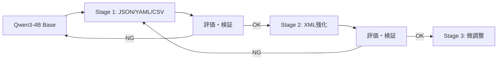
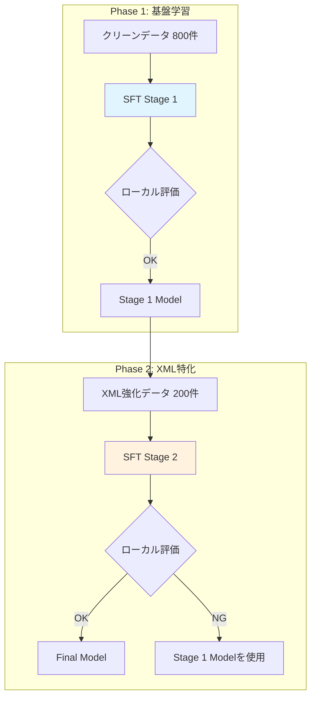

# v11戦略: LB 0.8超えを目指す総合アプローチ

## エグゼクティブサマリー

**現状**: v5.2 (LB 0.77702) が最高スコア
**目標**: LB 0.8以上（Person U達成レベル: 0.84）

**核心的な知見**:
1. **Person U (0.84達成)**: シーケンシャルSFT + ベースモデルの能力維持
2. **Person W (0.8+達成)**: 1,000件以下の高品質データで十分
3. **Person T (驚異的発見)**: TOMLデータなしでもTOML 84%達成（転移学習）
4. **過去の失敗**: v8段階的SFT（Catastrophic Forgetting）、v5.3/v5.4ターゲット追加（データ不均衡）

---

## 1. 現状分析

### 1.1 フォーマット別成功率と改善余地

| フォーマット | v5.2成功率 | Person U達成値 | Gap | 改善優先度 |
|------------|-----------|---------------|-----|-----------|
| **TOML** | **72.0%** | 92.0% | **+20%** | 🔴 最優先 |
| YAML | 88.6% | 100.0% | +11.4% | 🟡 高 |
| XML | 85.0% | 95.0% | +10% | 🟡 高 |
| CSV | 95.0% | 100.0% | +5% | 🟢 中 |
| JSON | 98.0% | 100.0% | +2% | 🟢 低 |

### 1.2 v5.2のエラー分析

| エラータイプ | 件数 | 主なフォーマット |
|-------------|------|-----------------|
| unknown | 9件 | TOML |
| markdown_block | 7件 | 各種 |
| natural_language_prefix | 1件 | - |
| natural_language_suffix | 1件 | - |

### 1.3 過去の失敗からの教訓

| バージョン | 試みた戦略 | 結果 | 失敗原因 |
|-----------|-----------|------|---------|
| v8 | 段階的SFT（4ステージ） | 失敗 | Catastrophic Forgetting、各ステージ間の干渉 |
| v5.3 | Empty Think + ハイパラ変更 + ターゲット追加 | 0.687（悪化） | 複数変更の負のシナジー |
| v5.4 | ターゲットサンプル17件追加 | 効果なし | データ不均衡、LR低すぎ |
| v9 | Empty Think未適用 | 0.061（壊滅） | tool_call漏洩 |

---

## 2. 戦略オプション

### 戦略A: 改良型シーケンシャルSFT（Person U方式の最適化）

**概要**: v8の失敗を踏まえ、より慎重なシーケンシャル学習を実施

**コンセプト**:


**v8との差異**:
1. 各ステージ間で厳密な評価・ロールバック機構
2. Person T知見適用: TOMLは明示的に学習しない（転移学習に依存）
3. データ量を大幅削減（各ステージ300-500件）

**メリット**:
- Person Uの成功パターンに最も近い
- フォーマット間の干渉を制御可能

**リスク**:
- 実験回数が多くなる（提出回数制限に注意）
- 各ステージで時間がかかる
- v8と同様の失敗リスクあり

**期待効果**: LB 0.80-0.84

---

### 戦略B: 高品質少量データ学習（Person W方式）

**概要**: 1,000件以下の厳選データで一括学習

**データ選定基準**:
1. パース成功率100%のサンプルのみ
2. conversionタスク中心（難易度が高い）
3. 深い構造を持つサンプルを優先（depth >= 3）
4. コードフェンス・説明文を含まないクリーンなデータ

**フォーマット配分**:
| フォーマット | 件数 | 配分根拠 |
|------------|------|---------|
| JSON | 200件 | 基礎フォーマット |
| YAML | 250件 | Person Tの知見：TOMLへの転移効果 |
| XML | 200件 | 改善余地大 |
| CSV | 100件 | 安定している |
| TOML | 50件 | 最小限（転移学習に期待） |
| **合計** | **800件** | |

**ハイパーパラメータ**:
```python
# Person Rベース + 調整
lora_r = 64
lora_alpha = 64
learning_rate = 3e-5  # 5e-5より保守的に
epochs = 2
batch_size = 16
neftune_noise_alpha = 5  # Person X推奨
```

**メリット**:
- 実装がシンプル
- 学習時間が短い（T4で約40分）
- Catastrophic Forgettingリスクが低い

**リスク**:
- データ選定の質に依存
- 単一学習で最適点に到達できるか不確実

**期待効果**: LB 0.78-0.82

---

### 戦略C: ハイブリッドアプローチ（推奨）

**概要**: 戦略AとBの長所を組み合わせ、Person Tの知見を最大活用

**核心アイデア**:
1. **TOMLを明示的に学習しない**（Person T発見の活用）
2. 少量高品質データ（800-1000件）
3. 2段階のみのシンプルなシーケンシャル学習
4. Empty Think Injection必須
5. NEFTune導入

**フェーズ構成**:


**Phase 1: 基盤学習**
- データ: 高品質800件（TOML含まず）
- 目標: JSON/YAML/CSV を100%、XMLを90%以上
- TOMLは転移学習効果で80%以上を期待

**Phase 2: XML特化（必要な場合のみ）**
- データ: XML特化200件（&エスケープ含む）
- 目標: XMLを95%以上に引き上げ
- 他フォーマットの崩壊がないか検証

**ハイパーパラメータ**:
```python
# Phase 1
phase1_config = {
    "lora_r": 64,
    "lora_alpha": 64,
    "learning_rate": "3e-5",
    "epochs": 2,
    "batch_size": 16,
    "neftune_noise_alpha": 5,
    "max_seq_length": 1024,
}

# Phase 2（Stage 1モデルをベースに）
phase2_config = {
    "lora_r": 32,           # 小さく（微調整）
    "lora_alpha": 32,
    "learning_rate": "1e-5", # 低く（既存能力を維持）
    "epochs": 1,
    "batch_size": 16,
}
```

**メリット**:
- Person T知見を最大活用（TOML学習不要）
- シンプルな2段階構成
- ロールバック可能

**リスク**:
- TOMLの転移学習効果が期待通りでない可能性
- XMLの2段階目で他フォーマットが崩れる可能性

**期待効果**: LB 0.80-0.84

---

## 3. 各戦略の比較

| 評価軸 | 戦略A | 戦略B | 戦略C（推奨） |
|--------|-------|-------|--------------|
| 実装難易度 | 高 | 低 | 中 |
| 実験回数 | 多（4+） | 少（1-2） | 中（2-3） |
| 学習時間 | 長 | 短 | 中 |
| Catastrophic Forgettingリスク | 高 | 低 | 中 |
| 期待LBスコア | 0.80-0.84 | 0.78-0.82 | 0.80-0.84 |
| 過去の失敗との類似性 | 高（v8） | 低 | 低 |

---

## 4. 推奨戦略: 戦略C（ハイブリッドアプローチ）

### 4.1 推奨理由

1. **Person T知見の活用**: TOMLを学習しないことで、データ効率とフォーマット間干渉を最小化
2. **シンプルな構成**: 2段階のみで複雑性を抑制（v8の4段階から削減）
3. **ロールバック可能**: Phase 2で問題があればPhase 1モデルを使用
4. **実績のある要素の組み合わせ**: Empty Think + NEFTune + 少量高品質データ

### 4.2 成功条件

| 条件 | 基準 |
|------|------|
| Phase 1後のローカル評価 | 全体90%以上、TOML 80%以上 |
| Phase 2後のローカル評価 | 全体93%以上、XML 95%以上 |
| エラーパターン | markdown_block: 0件、prefix/suffix: 0件 |

---

## 5. 実装ステップ

### Step 1: データ準備（Day 1前半）

**1.1 高品質データセット作成**
```python
# scripts/create_v11_curated_dataset.py

# 選定基準:
# 1. パース成功100%
# 2. コードフェンス混入なし
# 3. 説明文混入なし
# 4. depth >= 2の構造

# フォーマット配分:
# - JSON: 200件（conversion中心）
# - YAML: 250件（深い構造）
# - XML: 200件（&エスケープ含む）
# - CSV: 100件
# - TOML: 50件（最小限）
# 合計: 800件
```

**1.2 Empty Think Injection適用**
```python
# 全データに適用
# assistant出力を <think>\n</think>\n\n{data} に変換
```

### Step 2: Phase 1実行（Day 1後半-Day 2）

**2.1 ノートブック作成**
- `notebooks/SFT/v11_phase1.ipynb`
- データ: `inputs/sft_processed/v11_curated/train.json`

**2.2 学習設定**
```python
os.environ["SFT_BASE_MODEL"] = "Qwen/Qwen3-4B-Instruct-2507"
os.environ["SFT_DATASET_ID"] = "inputs/sft_processed/v11_curated/train.json"
os.environ["SFT_MAX_SEQ_LEN"] = "1024"
os.environ["SFT_EPOCHS"] = "2"
os.environ["SFT_LR"] = "3e-5"
os.environ["SFT_LORA_R"] = "64"
os.environ["SFT_LORA_ALPHA"] = "64"
os.environ["NEFTUNE_NOISE_ALPHA"] = "5"
```

**2.3 評価**
- local_eval.pyでフォーマット別評価
- 目標: 全体90%以上、TOML 80%以上

### Step 3: Phase 2実行（Day 2-Day 3、必要な場合のみ）

**3.1 条件判定**
```
Phase 2実行条件:
- XML < 95% の場合
- かつ TOML, YAML, JSON, CSV が目標以上の場合
```

**3.2 Phase 2設定**
```python
os.environ["SFT_BASE_MODEL"] = "{Phase1のマージモデルHFパス}"
os.environ["SFT_DATASET_ID"] = "inputs/sft_processed/v11_xml_focus/train.json"
os.environ["SFT_EPOCHS"] = "1"
os.environ["SFT_LR"] = "1e-5"  # 低く
os.environ["SFT_LORA_R"] = "32"  # 小さく
os.environ["SFT_LORA_ALPHA"] = "32"
```

### Step 4: 最終評価と提出（Day 3）

**4.1 ローカル評価**
- public_150.jsonで全フォーマット検証
- エラーパターンの確認

**4.2 LB提出**
- Phase 1モデルまたはPhase 2モデルを提出
- 目標: LB 0.80以上

---

## 6. 代替プランとフォールバック

### 6.1 Phase 1が期待通りでない場合

**症状**: TOML < 75%、または全体 < 85%

**対応**:
1. データ配分を調整（YAML増量でTOML転移促進）
2. ハイパラ調整（LRを5e-5に増加）
3. NEFTune alpha調整（10に増加）

### 6.2 Phase 2でCatastrophic Forgetting発生の場合

**症状**: XML向上したが、他フォーマットが5%以上低下

**対応**:
1. Phase 1モデルをそのまま使用
2. Phase 2のLRをさらに下げて再実験（5e-6）
3. 戦略Bにフォールバック

### 6.3 最終的に0.8未達の場合

**対応**:
1. v5.2 + NEFTuneのみの実験
2. DPOとの組み合わせ検討
3. データ品質の再精査

---

## 7. 技術的詳細

### 7.1 Empty Think Injection実装

```python
def apply_empty_think_injection(content: str) -> str:
    """assistantの出力にEmpty Think Injectionを適用"""
    # CoT部分を除去
    content = re.sub(r"Approach:.*?Output:", "", content, flags=re.DOTALL)

    # コードフェンス除去
    content = re.sub(r"```\w*\n?", "", content)
    content = re.sub(r"```", "", content)

    # 前後の説明文除去
    content = re.sub(r"^.*?(Here|Below|The following).*?:\s*\n", "", content)

    # Empty Think付与
    return f"<think>\n</think>\n\n{content.strip()}"
```

### 7.2 NEFTune設定

```python
from transformers import TrainingArguments

training_args = TrainingArguments(
    # ... 他の設定
    neftune_noise_alpha=5,  # 5-15が推奨範囲
)
```

### 7.3 マージモデルのアップロード（Phase間継承用）

```python
from unsloth import FastLanguageModel
from peft import PeftModel

# Phase 1モデルをマージ
base_model, tokenizer = FastLanguageModel.from_pretrained(
    model_name="Qwen/Qwen3-4B-Instruct-2507",
    max_seq_length=1024,
    dtype=torch.bfloat16,
    load_in_4bit=False,
)
model = PeftModel.from_pretrained(base_model, "path/to/phase1_lora")
model = model.merge_and_unload()

# HuggingFaceにアップロード
model.save_pretrained("path/to/merged_model")
tokenizer.save_pretrained("path/to/merged_model")
api.upload_folder(
    folder_path="path/to/merged_model",
    repo_id="your-repo/v11-phase1-merged",
)
```

---

## 8. 成功指標

### 8.1 フォーマット別目標

| フォーマット | Phase 1目標 | Phase 2目標 | Person U達成値 |
|------------|------------|------------|---------------|
| JSON | 100% | 100% | 100% |
| YAML | 100% | 100% | 100% |
| CSV | 100% | 100% | 100% |
| XML | 90%+ | **95%+** | 95% |
| TOML | **80%+** | 80%+ | 92% |
| **全体** | **93%+** | **95%+** | **97%+** |

### 8.2 LBスコア目標

| マイルストーン | スコア | 達成条件 |
|--------------|--------|---------|
| M1 | 0.78 | v5.2超え |
| **M2** | **0.80** | 目標達成 |
| M3 | 0.84 | Person Uレベル |

---

## 9. リスクマトリクス

| リスク | 発生確率 | 影響度 | 対策 |
|--------|---------|-------|------|
| TOML転移学習が効かない | 中 | 高 | YAML/JSON比率増加で対応 |
| Phase 2でCatastrophic Forgetting | 中 | 高 | Phase 1モデルをバックアップ |
| 提出回数制限超過 | 低 | 高 | ローカル評価で事前スクリーニング |
| 学習時間超過 | 低 | 中 | L4 GPU使用、データ削減 |

---

## 10. スケジュール

| 日 | 作業内容 | 成果物 |
|----|---------|--------|
| Day 1前半 | データ準備、スクリプト作成 | v11_curated_dataset |
| Day 1後半 | Phase 1ノートブック作成・実行 | v11_phase1_model |
| Day 2 | Phase 1評価、Phase 2準備 | 評価レポート |
| Day 3 | Phase 2実行（必要時）、LB提出 | 最終モデル、LB 0.8+ |

---

## 11. 次のアクション

1. [ ] `scripts/create_v11_curated_dataset.py` 作成
2. [ ] 高品質データ800件の選定・作成
3. [ ] Empty Think Injection適用
4. [ ] `notebooks/SFT/v11_phase1.ipynb` 作成
5. [ ] Phase 1実行・評価
6. [ ] 結果に基づきPhase 2判断
7. [ ] LB提出

---

## 付録: 重要な参照情報

### Person Uの成功パターン詳細

> 「なるべくベースモデルに近い方が文章読解力が高くて安定した合格スコアになる」

> 「TOMLの学習は想定外のデータで覚えている」

> 「Here!とかSure!が出たら、もうちょっと学習できそう。同じこと繰り返してるものが出たら、ちょっとやりすぎ」

### Person Tの重要発見

> 「TOMLデータを削除してSFT学習しても、TOML: 21/25 = 84.0%」

→ **TOMLは他フォーマット（特にYAML）からの転移学習で習得される**

### Person Wの効率的アプローチ

> 「最終的には1000件以下のデータで学習」

> 「基準となるLLMの性能が良い場合は、学習量を増やすよりも細かい調整」
