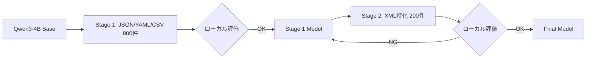

# v12戦略: スコア0.8超えを目指す新アプローチ

## エグゼクティブサマリー

**現状**: v5.2 (LB 0.77702) が最高スコア
**目標**: LB 0.8以上（Person U達成レベル: 0.84）

**核心的な教訓**:
1. **LR=5e-6が最適点** → これを変えると悪化（v5.6の失敗: LR=6e-6で0.68263）
2. **rsLoRA単独導入は効果なし** → v5.5B (0.76631) < v5.2 (0.77702)
3. **データ追加は慎重に** → v5.3/v5.4のターゲット追加は効果なし
4. **Sequential SFTは難しい** → v8シリーズでCatastrophic Forgetting

---

## 1. 現状分析

### 1.1 これまでの実験結果

| バージョン | パース成功率 | LBスコア | 手法 | 結果 |
|-----------|------------|---------|------|------|
| **v5.2** | **89.3%** | **0.77702** | LR=5e-6, r=64, α=128 | ✅ 最良 |
| v5.5B | - | 0.76631 | rsLoRA (r=128, LR=3e-6) | ❌ v5.2より低下 |
| v5.6 | - | 0.68263 | LR=6e-6 | ❌ Catastrophic Forgetting |
| v9 | - | 0.06098 | Empty Think未適用 | ❌ tool_call漏洩 |
| v8シリーズ | - | ? | Sequential SFT（4段階） | ❌ 各段階で崩壊 |

### 1.2 v5.2のフォーマット別成功率

| フォーマット | v5.2成功率 | Person U達成値 | Gap |
|------------|-----------|---------------|-----|
| **TOML** | **72.0%** | 92.0% | **+20%** |
| YAML | 88.6% | 100.0% | +11.4% |
| XML | 85.0% | 95.0% | +10% |
| CSV | 95.0% | 100.0% | +5% |
| JSON | 98.0% | 100.0% | +2% |

### 1.3 v5.2のエラーパターン

| エラータイプ | 件数 | 対策 |
|-------------|------|------|
| unknown | 9件 | 主にTOML構文エラー |
| markdown_block | 7件 | コードフェンス混入 |
| natural_language_prefix | 1件 | 説明文混入 |
| natural_language_suffix | 1件 | 説明文混入 |

---

## 2. 他参加者の重要知見

### 2.1 Person U（LB 0.84達成）- 最重要

```
達成結果:
CSV: 100%, JSON: 100%, TOML: 92%, XML: 95%, YAML: 100%

核心的発見:
1. パラメータ調整で凸型パターン → 最適点が存在
2. TOMLの学習は想定外のデータで覚えている
3. フォーマットAが良くなってもBが悪くなることがある
4. ベースモデルは特定フォーマットに100%の文法正解率を持つ

解決策: 段階的SFT
- ベースモデルに特定フォーマットのSFT実行
- そのモデルをベースに別のフォーマットの学習
- 細かいパラメータの凸探索で限界点に到達
```

### 2.2 Person W（LB 0.8+達成）

```
ポイント:
- 最終的に1000件以下のデータで学習
- ハイパラの大きな変更より微調整
- epoch2、T4で40分程度
- データの質（今回のコンペに適切か）が重要
```

### 2.3 Person T（驚異的発見）

```
発見:
- TOMLデータを削除しても、TOML 84%達成
- TOMLは他フォーマット（特にYAML）から転移学習
```

### 2.4 Person Z（LB 0.82+）/ Person AA（LB 0.8+）

```
ポイント:
- 低学習率 + 過学習防止
- rsLoRA推奨（rが大きくても効果的に学習）
- 正則化（dropout, weight_decay）が重要
- 勾配累積でノイズを抑える
```

### 2.5 Person X

```
効果:
- NEFTuneを導入 → 一番効いた
```

---

## 3. 失敗分析

### 3.1 なぜv5.5B（rsLoRA）は失敗したか

| 要因 | 分析 |
|------|------|
| LR変更 | 5e-6 → 3e-6に下げた → 最適点から外れた |
| 複数変更 | rsLoRA + LR変更 + dropout追加 → 効果が混在 |
| 結論 | **rsLoRA単独で、LR=5e-6を維持すべきだった** |

### 3.2 なぜv5.6（LR=6e-6）は壊滅したか

| 要因 | 分析 |
|------|------|
| LRが凸の最適点を超えた | 5e-6 → 6e-6の微増でも悪化 |
| 結論 | **LR=5e-6は厳密な最適点、変更禁止** |

### 3.3 なぜv8（Sequential SFT）は失敗したか

| 要因 | 分析 |
|------|------|
| 4段階は多すぎ | 各段階でCatastrophic Forgettingが蓄積 |
| Stage間の評価不足 | 崩壊を検知できなかった |
| 結論 | **2段階のみ、各段階で厳密評価が必要** |

---

## 4. 推奨戦略（優先度順）

### 戦略A: v5.2 + NEFTune（最優先）

**概要**: v5.2の最適設定を維持し、NEFTuneのみ追加

**根拠**:
- Person X: NEFTuneが一番効いた
- v5.2の設定（LR=5e-6, r=64, α=128）は最適点として維持

**ハイパーパラメータ**:
```python
# v5.2の設定を完全維持
os.environ["SFT_LR"] = "5e-6"
os.environ["SFT_LORA_R"] = "64"
os.environ["SFT_LORA_ALPHA"] = "128"
os.environ["SFT_LORA_DROPOUT"] = "0"
os.environ["SFT_EPOCHS"] = "1"
os.environ["SFT_WEIGHT_DECAY"] = "0.05"

# NEFTuneのみ追加
# training_argumentsに追加:
neftune_noise_alpha = 5  # 5-15が推奨範囲
```

**期待効果**: LB 0.78-0.80

**リスク**: 低（変更が最小限）

---

### 戦略B: 高品質1000件データ + v5.2設定

**概要**: Person Wスタイル、データ量を減らして質を上げる

**根拠**:
- Person W: 1000件以下で0.8+達成
- Person T: TOMLは学習データなしでも84%達成 → TOML含まなくてよい

**データ選定基準**:
1. パース成功率100%のサンプルのみ
2. コードフェンス・説明文を含まないクリーンなデータ
3. conversionタスク中心（難易度が高い）
4. TOMLは含まない（転移学習に期待）

**フォーマット配分**:
| フォーマット | 件数 | 配分根拠 |
|------------|------|---------|
| JSON | 250件 | 基礎フォーマット |
| YAML | 300件 | TOMLへの転移効果を期待 |
| XML | 250件 | 改善余地大 |
| CSV | 150件 | 安定している |
| TOML | 50件 | 最小限（転移学習に依存） |
| **合計** | **1000件** | |

**ハイパーパラメータ**:
```python
# v5.2の設定を維持
os.environ["SFT_LR"] = "5e-6"
os.environ["SFT_LORA_R"] = "64"
os.environ["SFT_LORA_ALPHA"] = "128"
os.environ["SFT_EPOCHS"] = "2"  # データ量が減るので2に
```

**期待効果**: LB 0.78-0.82

**リスク**: 中（データ選定の質に依存）

---

### 戦略C: v5.2 + 正則化強化

**概要**: Person Z/AAスタイル、過学習防止を強化

**根拠**:
- Person Z: 正則化でスコア0.82+達成
- Person AA: 過学習防止が重要

**ハイパーパラメータ**:
```python
# v5.2ベース、LRは維持
os.environ["SFT_LR"] = "5e-6"           # 維持（最適点）
os.environ["SFT_LORA_R"] = "64"          # 維持
os.environ["SFT_LORA_ALPHA"] = "128"     # 維持
os.environ["SFT_LORA_DROPOUT"] = "0.05"  # 0 → 0.05
os.environ["SFT_WEIGHT_DECAY"] = "0.1"   # 0.05 → 0.1
os.environ["SFT_EPOCHS"] = "2"           # 1 → 2
```

**期待効果**: LB 0.78-0.80

**リスク**: 中（正則化が強すぎると学習不足に）

---

### 戦略D: v5.2 + rsLoRA（LR維持版）

**概要**: v5.5Bの失敗を踏まえ、LRを5e-6で維持してrsLoRAを試す

**根拠**:
- Person AA: rsLoRA推奨
- v5.5Bの失敗はLR変更が原因の可能性

**ハイパーパラメータ**:
```python
# LRは5e-6で維持（これが重要）
os.environ["SFT_LR"] = "5e-6"
os.environ["SFT_LORA_R"] = "64"          # 維持（rsLoRAで効果的）
os.environ["SFT_LORA_ALPHA"] = "128"     # 維持
use_rslora = True                         # rsLoRA有効化
```

**期待効果**: LB 0.78-0.80

**リスク**: 中（v5.5Bで効果なしだった可能性）

---

### 戦略E: 2段階Sequential SFT（最後に試す）

**概要**: v8の失敗を踏まえ、2段階のみで慎重に実施

**根拠**:
- Person U: 段階的SFTで0.84達成
- v8の失敗: 4段階は多すぎた

**構成**:


**Stage 1: 基盤学習**
```python
os.environ["SFT_BASE_MODEL"] = "Qwen/Qwen3-4B-Instruct-2507"
os.environ["SFT_DATASET_ID"] = "inputs/sft_processed/v12_stage1/train.json"
os.environ["SFT_LR"] = "5e-6"
os.environ["SFT_EPOCHS"] = "2"
```

**Stage 2: XML特化（Stage 1モデルをベースに）**
```python
os.environ["SFT_BASE_MODEL"] = "your-repo/v12-stage1-merged"
os.environ["SFT_DATASET_ID"] = "inputs/sft_processed/v12_stage2_xml/train.json"
os.environ["SFT_LR"] = "3e-6"  # Stage 2は低めに
os.environ["SFT_EPOCHS"] = "1"
```

**期待効果**: LB 0.80-0.84

**リスク**: 高（Catastrophic Forgettingのリスク）

---

## 5. 実装計画

### Phase 1: 単一変更実験（戦略A, C, D）

| 実験 | 変更点 | 優先度 | 期待効果 |
|------|--------|--------|---------|
| v12.1 | v5.2 + NEFTune | 🔴 最優先 | 0.78-0.80 |
| v12.2 | v5.2 + 正則化強化 | 🟡 高 | 0.78-0.80 |
| v12.3 | v5.2 + rsLoRA（LR維持） | 🟢 中 | 0.78-0.80 |

### Phase 2: データ戦略（戦略B）

| 実験 | 内容 | 優先度 | 期待効果 |
|------|------|--------|---------|
| v12.4 | 1000件厳選データ | 🟡 高 | 0.78-0.82 |

### Phase 3: Sequential SFT（戦略E）

| 実験 | 内容 | 優先度 | 期待効果 |
|------|------|--------|---------|
| v12.5 | 2段階Sequential SFT | 🟢 中 | 0.80-0.84 |

---

## 6. 各戦略の実装詳細

### 6.1 v12.1: NEFTune導入

**必要なファイル**:
- `notebooks/SFT/v12.1_neftune.ipynb`

**変更箇所**:
```python
# TrainingArguments に追加
training_args = SFTConfig(
    # ... 既存設定
    neftune_noise_alpha=5,  # NEFTune追加
)
```

### 6.2 v12.4: 1000件厳選データ

**必要なファイル**:
- `scripts/create_v12_curated_dataset.py`
- `inputs/sft_processed/v12_curated/train.json`
- `notebooks/SFT/v12.4_curated_1k.ipynb`

**データ作成スクリプト**:
```python
# scripts/create_v12_curated_dataset.py

# 選定基準:
# 1. merged_dataset_final_clean.jsonlから選定
# 2. パース成功100%
# 3. コードフェンス混入なし
# 4. 説明文混入なし
# 5. TOMLは最小限（50件以下）

# フォーマット配分:
# - JSON: 250件（conversion中心）
# - YAML: 300件（深い構造優先）
# - XML: 250件（&エスケープ含む）
# - CSV: 150件
# - TOML: 50件（最小限）
```

### 6.3 v12.5: 2段階Sequential SFT

**必要なファイル**:
- `scripts/create_v12_stage1_dataset.py`
- `scripts/create_v12_stage2_xml_dataset.py`
- `notebooks/SFT/v12.5_stage1.ipynb`
- `notebooks/SFT/v12.5_stage2_xml.ipynb`

**Stage間のモデル継承**:
```python
# Stage 1モデルをマージしてHuggingFaceにアップロード
from unsloth import FastLanguageModel
from peft import PeftModel

base_model, tokenizer = FastLanguageModel.from_pretrained(
    model_name="Qwen/Qwen3-4B-Instruct-2507",
    max_seq_length=1024,
    dtype=torch.bfloat16,
    load_in_4bit=False,
)
model = PeftModel.from_pretrained(base_model, "path/to/stage1_lora")
model = model.merge_and_unload()

# HuggingFaceにアップロード
model.save_pretrained("path/to/merged_model")
api.upload_folder(
    folder_path="path/to/merged_model",
    repo_id="your-repo/v12-stage1-merged",
)
```

---

## 7. 成功指標

### 7.1 ローカル評価目標

| フォーマット | 現状 | 目標 | Person U |
|------------|------|------|----------|
| JSON | 98.0% | 100% | 100% |
| YAML | 88.6% | 95%+ | 100% |
| TOML | 72.0% | 85%+ | 92% |
| XML | 85.0% | 90%+ | 95% |
| CSV | 95.0% | 100% | 100% |
| **全体** | **89.3%** | **94%+** | **97%+** |

### 7.2 LBスコア目標

| マイルストーン | スコア | 達成条件 |
|--------------|--------|---------|
| M1 | 0.78 | v5.2超え |
| **M2** | **0.80** | 目標達成 |
| M3 | 0.84 | Person Uレベル |

---

## 8. リスクと対策

| リスク | 発生確率 | 影響度 | 対策 |
|--------|---------|-------|------|
| NEFTuneが効かない | 中 | 中 | 正則化強化にシフト |
| データ厳選が裏目 | 中 | 高 | v5.2データに戻す |
| Sequential SFTで崩壊 | 高 | 高 | Stage 1モデルをバックアップ |
| 提出回数制限超過 | 低 | 高 | ローカル評価で事前スクリーニング |

---

## 9. 次のアクション

1. [ ] **v12.1ノートブック作成**: v5.2 + NEFTune
2. [ ] **v12.1実験実行**: NEFTuneの効果確認
3. [ ] **結果に基づき次の戦略決定**:
   - 効果あり → さらなる最適化
   - 効果なし → 戦略B/Cに移行

---

## 付録: 重要な技術的詳細

### A. NEFTune設定

```python
from trl import SFTConfig

training_args = SFTConfig(
    # ... 他の設定
    neftune_noise_alpha=5,  # 5-15が推奨範囲
)
```

### B. rsLoRA設定

```python
from unsloth import FastLanguageModel

model = FastLanguageModel.get_peft_model(
    model,
    r=64,
    lora_alpha=128,
    lora_dropout=0,
    use_rslora=True,  # rsLoRA有効化
    # ...
)
```

### C. Empty Think Injection

```python
def apply_empty_think_injection(content: str) -> str:
    # CoT除去
    content = re.sub(r"Approach:.*?Output:", "", content, flags=re.DOTALL)
    # コードフェンス除去
    content = re.sub(r"```\w*\n?", "", content)
    content = re.sub(r"```", "", content)
    # Empty Think付与
    return f"<think>\n</think>\n\n{content.strip()}"
```

---

## 結論

**最も重要な教訓**: LR=5e-6は最適点であり、これを変更すると悪化する。

**推奨アプローチ**:
1. まずv5.2 + NEFTuneを試す（最小変更で最大効果を狙う）
2. 効果がなければ、正則化強化またはデータ厳選に移行
3. Sequential SFTは最後の手段（リスクが高い）

**成功の鍵**:
- 単一変更で効果を検証
- ローカル評価で事前スクリーニング
- 提出回数を節約
