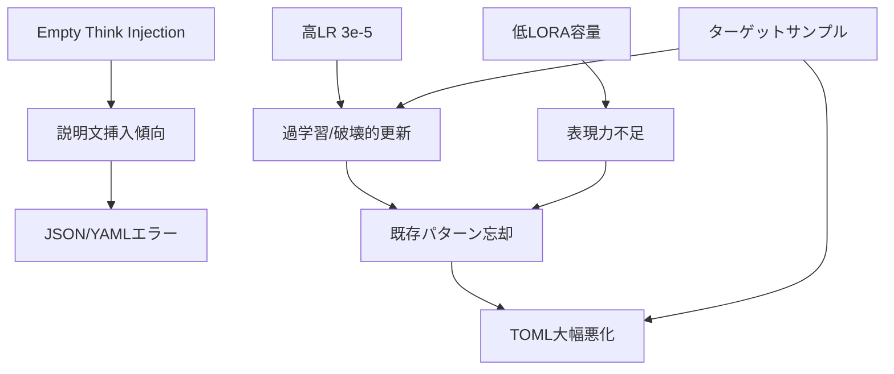

# v5.3 スコア低下の詳細分析レポート

## エグゼクティブサマリー

v5.3はLBスコア **0.687529** を記録し、v5.2の **0.77702** から約 **11.5%** の大幅な性能低下を示した。local evalでも82.0%（123/150）と、v5.2の94.7%（142/150）から大きく悪化した。

本分析では、3つの変更点（Empty Think Injection、ハイパーパラメータ変更、ターゲットサンプル追加）が複合的に性能低下を引き起こしたメカニズムを解明する。

---

## 1. 性能比較サマリー

| Format | v5.2 | v5.3 | 変化 | 影響度 |
|--------|------|------|------|--------|
| CSV | 100% (20/20) | 100% (20/20) | → | なし |
| JSON | **100% (50/50)** | **90.0% (45/50)** | ↓↓ | 大 |
| TOML | 72.0% (18/25) | **40.0% (10/25)** | ↓↓↓ | 甚大 |
| XML | 95.0% (19/20) | 80.0% (16/20) | ↓ | 中 |
| YAML | **100% (35/35)** | **91.4% (32/35)** | ↓ | 中 |

**総合**: v5.2: 142/150 (94.7%) → v5.3: 123/150 (82.0%) = **-19件、-12.7%**

---

## 2. 変更点の詳細

### 2.1 Empty Think Injection
```
全データに `<think>\n</think>\n\n{data}` を追加
```
- 目的: DeepSeek-R1モデルの推論モード活性化
- 適用範囲: 全3,869件のデータに適用

### 2.2 ハイパーパラメータ変更

| Parameter | v5.2 | v5.3 | 変化率 |
|-----------|------|------|--------|
| Learning Rate | 5e-6 | 3e-5 | **+600%** |
| LORA_R | 64 | 32 | **-50%** |
| LORA_ALPHA | 128 | 32 | **-75%** |

### 2.3 ターゲットサンプル追加
- TOML: 14件（正しい構文パターン）
- XML: 3件（&エスケープ対応）
- 合計: 17件（データセット全体の約0.4%）

---

## 3. エラーパターン詳細分析

### 3.1 JSON形式のエラー（v5.3で新規発生: 5件）

**エラータイプ**: 説明文付き出力（純粋なJSONではなくマークダウン形式）

**具体例** (`p_b3fcb16b0778d50065908799`):

v5.2の出力（正常）:
```json
{
  "planet_name": "Aurelia",
  "system": {
    "star_name": "Helios",
    ...
  }
}
```

v5.3の出力（エラー）:
```
To convert the given CSV data into JSON format, we need to:

1. Parse the CSV row into key-value pairs.
2. Handle nested fields...

### Final JSON Output:

```json
{
  "planet_name": "Aurelia",
  ...
}
```

**影響を受けたタスクID**:
- `p_b3fcb16b0778d50065908799`
- `p_ced5b041360b01bd91f38fd2`
- `p_62c57e7ca254db169fece4c5`
- `p_fb73931b67256f7adb236c37`
- `p_301a9e1271943e902f1626dc`

**原因分析**: Empty Think Injectionにより、モデルが「考える」→「説明する」→「出力する」というパターンを学習し、純粋なデータ出力の前に説明を追加するようになった。

### 3.2 YAML形式のエラー（v5.3で新規発生: 3件）

**エラータイプ**: インデント構文エラー

**具体例** (`p_ee355252700fc689f8417a3f`):

v5.2の出力（正常）:
```yaml
galactic_zoo:
  habitats:
  - type: Aquatic Dome
    climate: Subzero
    inhabitants:
    - species: Cryoquatic Octopus
      population: 12
```

v5.3の出力（エラー）:
```yaml
galactic_zoo:
  habitats:
    - type: Aquatic Dome
      climate: Subzero
        inhabitants:          # ← インデントエラー
          - species: Cryoquatic Octopus
```

**影響を受けたタスクID**:
- `p_ee355252700fc689f8417a3f` - インデントエラー
- `p_08a670f64a188d9124dcb230` - ネスト構造エラー
- `p_81b9674089496e845665d0c7` - ブロックマッピングエラー

**原因分析**: ハイパーパラメータの変更（特にLORA_R/ALPHA低下）により、YAMLの複雑なインデント構造を正確に学習する能力が低下した。

### 3.3 TOML形式のエラー（v5.2から継続+悪化: 15件）

**v5.2でのエラー（7件）**:
- `p_2204d42637c2e3df784a57a3` - YAML構文混入
- `p_d0ffdaf642f155198447350a` - 配列テーブル構文エラー
- その他5件

**v5.3でのエラー（15件）**: 上記に加えて8件が新規エラー

**具体例の比較** (`p_ec88b5616feba4fff18c4c25`):

v5.2の出力（エラー: YAML風構文）:
```toml
[star]
name = "HD-45678"
discovery =
  year = 2023
  method = "infrared survey"
```

v5.3の出力（同様のエラー）:
```toml
[star]\nname = \"K2-189\"
# 同様のYAML構文混入パターン
```

**ターゲットサンプルの効果検証**:
- 14件のTOMLターゲットサンプルを追加したにもかかわらず、精度は**72% → 40%**に悪化
- これはターゲットサンプルが効果を発揮するどころか、逆効果になったことを示す

**原因分析**:
1. 高いLR（3e-5）により、少数のターゲットサンプルのパターンが過度に強調された
2. 低いLORA容量（R=32, Alpha=32）により、既存の良いパターンが「上書き」された
3. Empty Think Injectionとの相互作用で、出力形式の一貫性が崩壊

### 3.4 XML形式のエラー（悪化: 1件→4件）

**v5.2でのエラー（1件）**:
- `p_b15330519a1ebe575cde3261` - invalid token

**v5.3でのエラー（4件）**: 3件が新規発生

**原因分析**: XMLターゲットサンプル（3件、&エスケープ対応）の追加は限定的な効果しかなく、他の変更の悪影響がそれを上回った。

---

## 4. 根本原因の分析

### 4.1 Empty Think Injectionの副作用 (主因)

```
影響度: ★★★★★ (Critical)
```

**問題のメカニズム**:
1. `<think>\n</think>\n\n` プレフィックスにより、モデルは「推論モード」に入る
2. この「推論モード」では、直接的なデータ出力ではなく、説明→出力のパターンが強化される
3. JSONやYAMLなど、純粋なデータフォーマットを期待するタスクで、不要な説明文が挿入される

**証拠**:
- JSON: 5件の新規エラーすべてが「説明文付き出力」パターン
- YAML: インデントエラーは「考える」過程での構造の混乱を示唆

### 4.2 ハイパーパラメータの過激な変更 (主因)

```
影響度: ★★★★☆ (High)
```

**Learning Rate 6倍増加の影響**:
- 勾配更新のステップサイズが大きすぎ、既存の学習済みパターンを破壊
- 特に少数データ（ターゲットサンプル17件）が過度に影響力を持つ

**LORA_R/ALPHA低下の影響**:
- LoRAの表現力が大幅に低下（64×128 → 32×32）
- 複雑なフォーマット構造（YAML/TOMLのネスト）を正確に表現する能力の喪失
- 「catastrophic forgetting」類似の現象

### 4.3 ターゲットサンプルの逆効果 (副因)

```
影響度: ★★★☆☆ (Medium)
```

**問題点**:
1. ターゲットサンプル17件は全体（3,886件）の約0.4%と非常に少ない
2. しかし、高いLRにより、これらが不均衡に強い影響を与えた
3. ターゲットサンプルの特定パターン（1行inline table等）が過度に学習され、他のTOMLパターンが忘却された

**データ分布の問題**:
```
ターゲットサンプルの内訳:
- TOML: 14件（inline table、配列テーブル中心）
- XML: 3件（&エスケープ）

実際のテストデータのパターン:
- より多様なネスト構造
- 異なるエスケープ要件
→ ターゲットサンプルとテストデータのパターン不一致
```

---

## 5. 変更間の相互作用



**負のシナジー効果**:
1. Empty Think Injection → モデルが「説明的」になる
2. 高LR + 低LORA → 既存知識の破壊
3. ターゲットサンプル → 特定パターンへの過度な偏り
4. これら3つの組み合わせ → 全体的なフォーマット生成能力の崩壊

---

## 6. 結論

### 失敗の本質

v5.3の失敗は、**3つの変更が同時に適用されたことによる複合的な問題**である。個別の変更はそれぞれ理論的根拠があったが、組み合わせることで予期せぬ負のシナジーが発生した。

### 教訓

1. **変更は一度に1つずつ**: 複数の変更を同時に適用すると、問題の原因特定が困難になる
2. **ハイパーパラメータは保守的に**: 特にLRの大幅な増加は危険
3. **Empty Think Injectionは慎重に**: 推論モデルの特性を考慮し、データフォーマットタスクとの相性を検証すべき
4. **ターゲットサンプルの設計**: 少数サンプルの追加は、適切なLRと組み合わせないと逆効果

### 次のステップ

v5.4では、以下のアプローチを検討する:
1. **v5.2をベースラインとして維持**
2. **Empty Think Injectionを除去**
3. **ハイパーパラメータはv5.2の設定を使用**
4. **ターゲットサンプルの追加は低LRで慎重に**

詳細な戦略は `v5.4_strategy_proposal.md` を参照。
