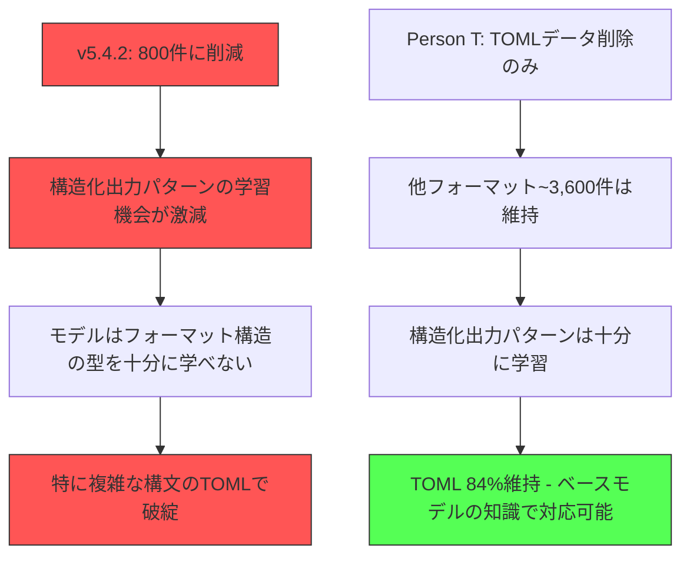

# v5.4.2 失敗分析: TOML精度大幅低下の根本原因

## エグゼクティブサマリー

v5.4.2は「高品質800件 + TOML50件」戦略を採用したが、**LBスコア0.708615**（v5.2: 0.77702から**-0.068低下**）という結果に終わった。特にTOML精度が**52%**（v5.2: 72%から**-20%**）と壊滅的。

**根本原因**: データ量の大幅削減により、モデルが「構造化フォーマット出力パターン」を学ぶ機会を失った。

---

## 1. 結果比較

### 1.1 フォーマット別パース成功率

| フォーマット | v5.4.2 | v5.2 | 差分 | 評価 |
|------------|--------|------|------|------|
| CSV | 100.0% (20/20) | 95.0% | +5.0% | ✅ 改善 |
| JSON | 100.0% (50/50) | 98.0% | +2.0% | ✅ 改善 |
| **TOML** | **52.0% (13/25)** | **72.0%** | **-20.0%** | ❌ 壊滅 |
| XML | 90.0% (18/20) | 85.0% | +5.0% | ✅ 改善 |
| YAML | 100.0% (35/35) | 88.6% | +11.4% | ✅ 改善 |
| **全体** | **90.67%** | **94.67%** | **-4.0%** | ❌ 低下 |

### 1.2 v5.4.2 TOMLエラー詳細（12件）

| エラータイプ | 件数 | エラーメッセージ |
|-------------|------|-----------------|
| 複数行inline table | 4件 | Invalid inline table encountered |
| 値なしキー | 3件 | Key name found without value |
| 重複キー | 2件 | What? list already exists? / Duplicate keys! |
| キー名不正文字 | 2件 | Found invalid character in key name |
| inline table値エラー | 1件 | Invalid inline table value encountered |

---

## 2. データセット構成比較

### 2.1 v5.2 vs v5.4.2

| 項目 | v5.2 | v5.4.2 | 比率 |
|------|------|--------|------|
| **総サンプル数** | 3,869件 | 800件 | **20.7%** |
| **TOML件数** | ~170件 | 50件 | **29.4%** |
| **Empty Think Injection** | なし | あり | - |

### 2.2 v5.4.2のフォーマット分布（推定）

```
JSON: ~300件 (37.5%)
YAML: ~300件 (37.5%)
CSV: ~80件 (10.0%)
XML: ~70件 (8.8%)
TOML: 50件 (6.3%)
```

---

## 3. Person Tの実験との決定的な違い

### 3.1 Person Tの発見

> "TOMLデータを削除してSFT学習した結果"
> - TOML: 21/25 = **84.0%**
> - 全体: 145/150 = **96.7%**
>
> "TOMLの学習はTOMLデータから来ていない"

Person Tはフルデータセットから**TOMLのみを削除**しても84%を維持できた。

### 3.2 v5.4.2との違い

| 観点 | Person T | v5.4.2 |
|------|----------|--------|
| ベースデータ量 | フル（~3,800件以上） | **800件（20%以下）** |
| TOML削除後の総量 | ~3,600件以上 | - |
| 他フォーマットの学習機会 | 十分 | **不十分** |
| TOML精度 | 84% | **52%** |

### 3.3 この差が示す本質

Person Tの実験は「**TOMLデータを削除しても**、他の大量データからフォーマット出力パターンを学習できる」ことを示した。

しかしv5.4.2は：
- 全データを800件に削減
- **フォーマット出力パターン自体を学ぶ機会が激減**
- TOMLだけでなく、構造化出力の「型」を忘れた

---

## 4. 根本原因分析

### 4.1 仮説検証

| 仮説 | 検証結果 | 判定 |
|------|----------|------|
| A: TOML50件は絶対的に少ない | Person Tは0件でも84%達成 → TOML件数は直接原因ではない | ❌ |
| B: データセット全体のバランス崩れ | 800件では全フォーマットの学習機会不足 | ⚠️ 部分的 |
| **C: 「構造化出力パターン」学習の機会喪失** | 3,800件→800件で80%減、パターン学習が不十分 | ✅ **主因** |
| D: Empty Think Injectionの悪影響 | CSV/JSON/YAML/XMLは改善、TOML特有の問題ではない | ❌ |

### 4.2 根本原因の構造



### 4.3 Person Uの知見が裏付ける理論

> "TOMLの学習はおもっていたのと違うデータで覚えている"
> "そもそもベースモデルは特定フォーマットに対しては100%の文法正解率をもっている"

つまり：
1. **ベースモデル（Qwen3-4B）はTOML構文を既に知っている**
2. SFTで学ぶのは「いつ・どのように構文を使うか」というパターン
3. **大量のフォーマット出力例**がこのパターン学習を支える
4. データ量を減らすと、パターン学習が不十分になり、ベースモデルの知識をうまく引き出せなくなる

---

## 5. TOMLエラーの技術的分析

### 5.1 主要エラーパターン

#### パターン1: 複数行inline table（4件）

```toml
# ❌ v5.4.2の出力（エラー）
exhibits = [
  {
    title = "Echoes"
    artist = "Chen"
  }
]

# ✅ 正しいTOML
exhibits = [{ title = "Echoes", artist = "Chen" }]
```

**原因**: モデルがJSON/YAMLのネスト構造をそのままTOMLに適用

#### パターン2: 値なしキー（3件）

```toml
# ❌ v5.4.2の出力（エラー）
[planet]
discovery =
  { year = 2023 }

# ✅ 正しいTOML
[planet]
discovery = { year = 2023 }
```

**原因**: YAML風のインデント構造をTOMLに持ち込んでいる

#### パターン3: 重複キー（2件）

```toml
# ❌ v5.4.2の出力（エラー）
[artifact.inscriptions.list]
language = "Latin"

[artifact.inscriptions.list]  # 重複エラー
language = "Greek"

# ✅ 正しいTOML（配列テーブル構文）
[[artifact.inscriptions.list]]
language = "Latin"

[[artifact.inscriptions.list]]
language = "Greek"
```

**原因**: `[[table]]`（配列テーブル）と`[table]`（単一テーブル）の使い分けができていない

### 5.2 エラーパターンの示唆

これらのエラーは**「TOML構文を知らない」のではなく「いつどの構文を使うか判断できない」**ことを示している。これはまさにパターン学習の不足を裏付ける。

---

## 6. 今後の方針提案

### 6.1 推奨戦略: v5.2ベースに戻す

| 優先度 | 戦略 | 説明 | 期待効果 |
|--------|------|------|----------|
| **1** | **v5.2をそのまま使用** | 既に94.7%達成、破壊しない | 確実に0.777維持 |
| 2 | v5.2 + TOMLターゲット追加学習 | v5.2モデルにTOML特化サンプルで追加SFT | +1-2%改善可能性 |
| 3 | 高品質1,500-2,000件データ | 800件は少なすぎ、1,500件以上を推奨 | 中程度のリスク |

### 6.2 「データ量」に関する教訓

Person Wの知見：
> "最終的には1000件以下のデータで学習"
> "データは多ければ多いほどいいのではなくて、質が重要"

しかし、これは**既に高性能なベースモデル**と**適切なハイパーパラメータ**が前提。

v5.4.2の失敗が示すのは：
- **最低ライン**がある（800件は下回った）
- 「少量高品質」は「極端な削減」とは違う
- Person Wも「1000件以下」であって「800件」ではない

### 6.3 具体的な次ステップ

#### Option A: 安全策（推奨）

```
v5.2をベースラインとして維持
→ TOMLターゲットサンプル（20-30件）で追加学習
→ LR=1e-6、epoch=1で慎重に
→ 効果なしならv5.2のまま提出
```

#### Option B: 再挑戦策

```
データセットを1,500-2,000件に再設計
→ フォーマット分布を維持（TOML 6-8%）
→ v5.2と同じハイパーパラメータ
→ 新規学習
```

#### Option C: Sequential Learning（Person U方式）

```
Stage 1: JSON/CSV で学習
Stage 2: YAMLを追加
Stage 3: XML/TOMLを追加
→ 各ステージでモデルをマージ
```

---

## 7. 結論

### 7.1 v5.4.2失敗の本質

**「高品質・少量」と「パターン学習の機会確保」のバランスを見誤った。**

- TOML50件が少ないのが問題ではない（Person Tは0件で84%）
- **総データ量800件が臨界点を下回った**
- 結果、モデルは構造化出力の「型」を十分に学習できなかった

### 7.2 学んだ教訓

1. **データ量には最低ラインがある** - 800件は不十分
2. **TOMLの学習はTOMLデータだけではない** - 他フォーマットからもパターンを学ぶ
3. **ベースモデルの能力を引き出すには適切な学習量が必要**
4. **v5.2（3,869件）のバランスは実は良かった**

### 7.3 推奨アクション

**v5.2をベースラインとして維持し、慎重な追加学習のみ検討する。**

極端なデータ削減は避け、「質」と「量」のバランスを取る戦略に切り替える。

---

## 参考資料

- [v5.4.2推論結果](../outputs/inference_sft_v5.4.2.json)
- [v5.2推論結果](../outputs/inference_sft_v5.2.json)
- [v5.4データセット](../inputs/sft_processed/v5.4/train.json)
- [他参加者の知見](../information/other_members_ideas.md)
- [v5.4結果分析（v5.4.1）](./v5.4_result_analysis.md)
