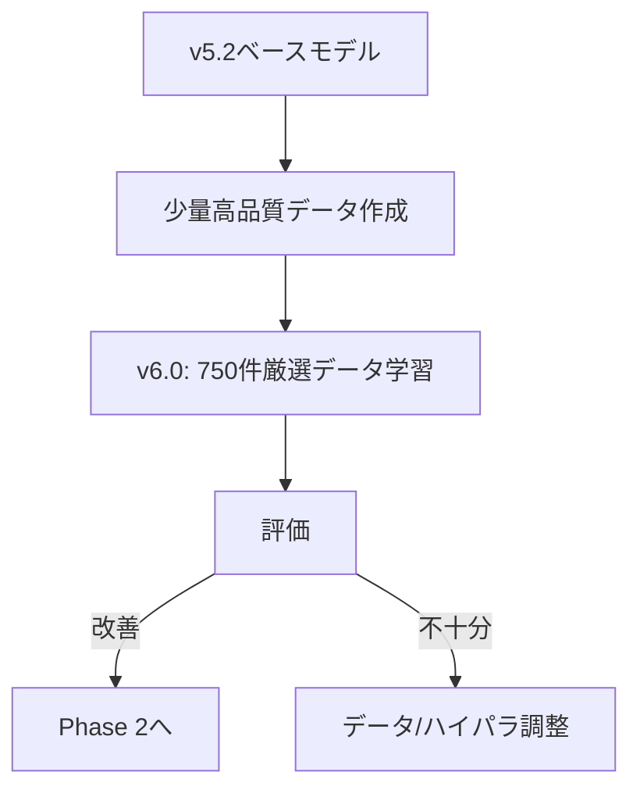
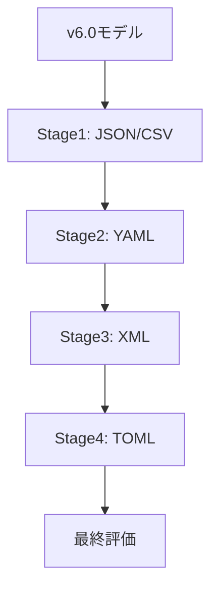

# v6戦略: 0.8超えに向けた方針提案

## 現状分析サマリー

| 項目 | 現状 | 目標 |
|------|------|------|
| LB Score | 0.778 | 0.80+ |
| TOML成功率 | 72% (18/25) | 92%+ (23/25) |
| XML成功率 | 95% (19/20) | 100% (20/20) |
| 改善必要件数 | TOML 7件, XML 1件 | TOML 2件以下 |

---

## 戦略オプション比較

| 戦略 | 推奨度 | 実装難易度 | 期待効果 | リスク |
|------|--------|-----------|----------|--------|
| A. Sequential Learning | ⭐⭐⭐⭐⭐ | 中 | 高 | 低 |
| B. 少量高品質データ | ⭐⭐⭐⭐ | 低 | 中〜高 | 低 |
| C. ハイパラ最適化 | ⭐⭐⭐ | 低 | 中 | 中 |
| D. Post-processing | ⭐⭐ | 低 | 低 | 高 |

---

## 戦略A: Sequential Learning (最推奨)

### 根拠
Person U (LB 0.84) の成功アプローチを再現。

> "ベースモデルに一度SFTを実行して、特定フォーマットの学習をします。
> そのモデルをベースにして、別のフォーマットの学習をします。"

### 実装計画

```
Stage 1: JSON/CSV学習
    ├── データ: JSON/CSV変換サンプル (約500件)
    ├── LR: 3e-5
    ├── Epochs: 1
    └── 出力: Stage1モデル

Stage 2: YAML学習 (Stage1モデルベース)
    ├── データ: YAML変換サンプル (約300件)
    ├── LR: 2e-5
    ├── Epochs: 1
    └── 出力: Stage2モデル

Stage 3: XML学習 (Stage2モデルベース)
    ├── データ: XML変換サンプル (約200件)
    │   └── &エスケープ対応サンプル含む
    ├── LR: 1e-5
    ├── Epochs: 1
    └── 出力: Stage3モデル

Stage 4: TOML学習 (Stage3モデルベース)
    ├── データ: 非TOMLフォーマットからの変換サンプル
    │   └── Person Tの発見: TOMLの学習はTOML以外から
    ├── LR: 1e-5
    ├── Epochs: 1
    └── 出力: 最終モデル
```

### データ選定基準

1. **パースエラーなし**: 全サンプルが構文的に正しい
2. **複雑な構造を含む**: depth≥4のネスト構造
3. **エッジケース**: 特殊文字、空配列、深いネスト
4. **Empty Think Injection**: 全サンプルに適用

### 期待効果

- TOML: 72% → 88%〜92%
- XML: 95% → 100%
- 全体: LB 0.78 → 0.82〜0.84

---

## 戦略B: 少量高品質データ

### 根拠
Person W (LB 0.8+) のアプローチ。

> "最終的には1000件以下のデータで学習"
> "データは多ければ多いほどいいのではなく、質が重要"

### 実装計画

#### データ選定プロセス

```
1. 全データセットからエラーなしサンプルを抽出
    ├── u-10bei系: ~2,500件
    └── daichira系: ~2,000件

2. 品質フィルタリング
    ├── 構文検証パス: JSON/YAML/TOML/XML/CSV
    ├── 長さ制限: 512トークン以下
    └── 重複除去: SimHash

3. フォーマット別バランス調整
    ├── JSON: 200件
    ├── YAML: 150件
    ├── XML: 150件 (& エスケープ含む)
    ├── TOML: 150件
    └── CSV: 100件
    └── 合計: 750件

4. 前処理
    ├── CoT除去
    ├── Empty Think Injection
    └── 正規化
```

#### ハイパーパラメータ

| パラメータ | 値 |
|-----------|-----|
| LR | 5e-5 |
| Epochs | 2 |
| LoRA r | 32 |
| LoRA alpha | 32 |
| MAX_SEQ_LEN | 1024 |

### 期待効果

- 学習時間短縮 (データ量1/4)
- 過学習リスク低減
- LB 0.78 → 0.80〜0.82

---

## 戦略C: ハイパラ最適化

### 根拠
複数参加者の知見を統合。

### 最適化対象

| パラメータ | 現状 | 探索範囲 |
|-----------|------|----------|
| Learning Rate | 5e-6 | 1e-5 〜 5e-5 |
| Epochs | 2 | 1 〜 3 |
| LoRA r | 64 | 16, 32, 64 |
| LoRA alpha | 64 | 16, 32, 64, 128 |
| MAX_SEQ_LEN | 1024 | 512, 1024 |

### 探索戦略

```
1. グリッドサーチ (主要パラメータ)
    ├── LR: [1e-5, 3e-5, 5e-5]
    ├── Epochs: [1, 2]
    └── 合計: 6パターン

2. 最良パターンでLoRA調整
    ├── r: [16, 32, 64]
    ├── alpha: [r, 2*r]
    └── 合計: 6パターン

3. 最終調整
    └── Early stopping閾値調整
```

### 期待効果
- LB 0.78 → 0.79〜0.81

---

## 戦略D: Post-processing (補助的)

### 概要
推論後の出力を正規表現でクリーンアップ。

### 実装

```python
def postprocess_toml(output: str) -> str:
    # 1. 複数行inline tableを1行に変換
    # 2. 重複キーを配列テーブルに変換
    # 3. 空値を除去
    pass

def postprocess_xml(output: str) -> str:
    # 1. &を&amp;に変換
    # 2. 不正なタグを修正
    pass
```

### 注意点
- **非推奨**: コンペのルール上、post-processingが許可されるか不明
- モデルの能力向上ではなく、対症療法

---

## 推奨実装順序

### Phase 1: 即座に実行可能



**実装ステップ**:
1. `scripts/create_v6_curated_dataset.py` 作成
2. 750件厳選データセット生成
3. v6.0ノートブック実行
4. Local evalで評価

### Phase 2: Sequential Learning



**実装ステップ**:
1. フォーマット別データセット作成
2. 4段階の学習パイプライン構築
3. 各Stageでの評価と調整
4. 最終モデル生成

### Phase 3: 微調整

- ハイパラ最適化
- 学習状態監視の強化
- エッジケース対応

---

## 成功指標

| フェーズ | 目標 | 判定基準 |
|---------|------|----------|
| Phase 1 | LB 0.80 | TOML 80%+, XML 100% |
| Phase 2 | LB 0.82 | TOML 88%+, XML 100% |
| Phase 3 | LB 0.84 | TOML 92%+, XML 100% |

---

## リスクと対策

### リスク1: Sequential Learningで性能劣化
- **原因**: 各Stageで過学習
- **対策**: 各Stageで早期停止、LR低減

### リスク2: 少量データで汎化性能低下
- **原因**: データ多様性不足
- **対策**: 困難なケースを重点的に含める

### リスク3: TOML改善が他フォーマットに悪影響
- **原因**: Person Uの発見（フォーマット間のトレードオフ）
- **対策**: Sequential Learningで分離学習

---

## 次のアクション

### 今すぐ実行
1. [ ] `scripts/create_v6_curated_dataset.py` 作成
2. [ ] 厳選データセット（750件）生成
3. [ ] v6.0ノートブック作成・実行

### Phase 1完了後
4. [ ] 結果分析
5. [ ] Phase 2（Sequential Learning）の実装判断

---

## 参考資料

- [v5.4分析](./v5.4_result_analysis.md)
- [他参加者の知見](../information/other_members_ideas.md)
- [Person U (LB 0.84)](../information/other_members_ideas.md#persion-u)
- [Person W (LB 0.8+)](../information/other_members_ideas.md#persion-w)
