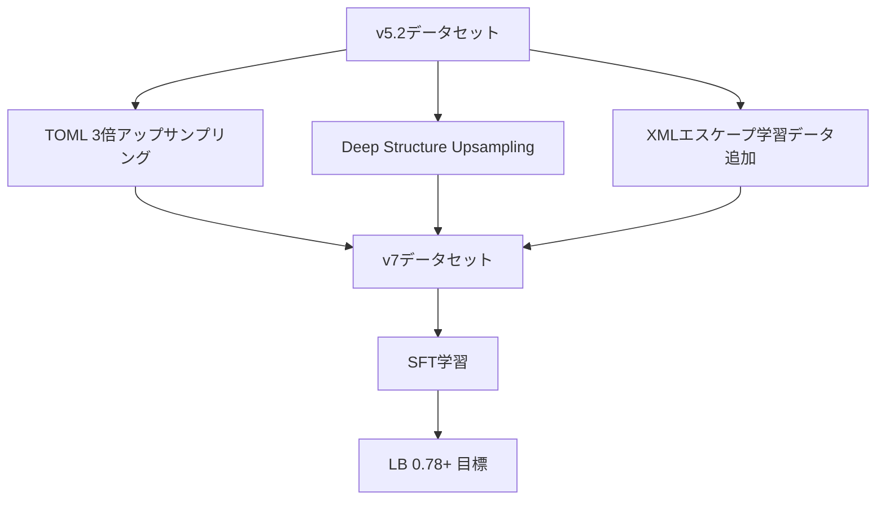
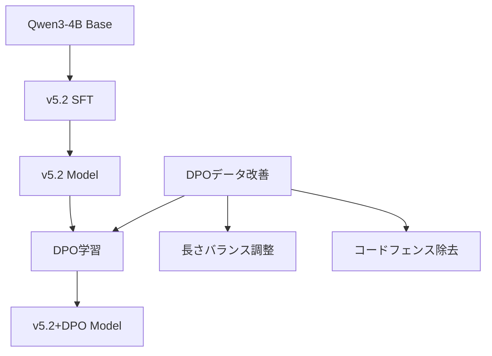
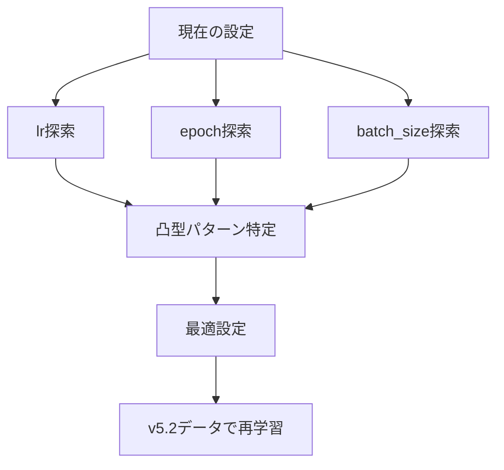
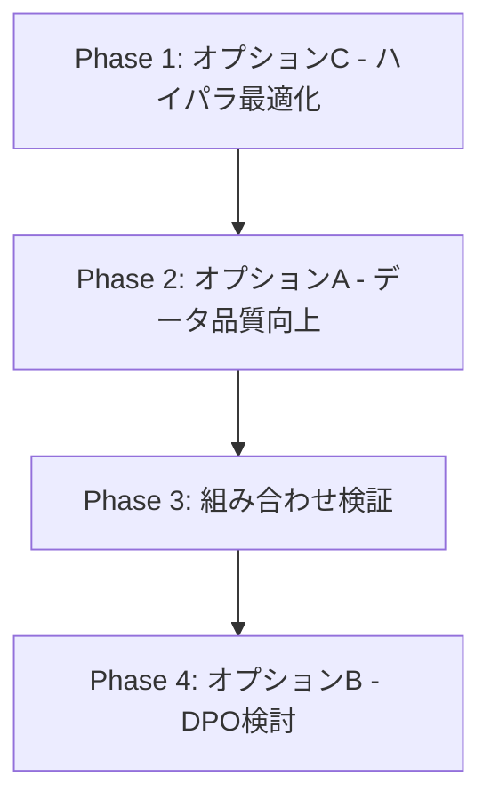

# v7 戦略分析: 0.77702超えのための計画

## エグゼクティブサマリー

**目標**: 現在の最高スコア v5.2 SFT (LB 0.77702) を超える

**現状スコア一覧**:
| バージョン | 手法 | LB スコア | 備考 |
|-----------|------|-----------|------|
| v5.2 | SFT | **0.77702** | 現在の最高スコア |
| v6 | Empty Think Injection | 0.735894 | v5.2より約0.04低下 |
| DPO v1 | DPO単独 | 0.70663 | SFTに大きく劣る |
| DPO v0 | DPO単独 | 0.701763 | ベースライン |

**結論**: データ品質向上とハイパラ最適化の組み合わせが最も有望

---

## 1. 現状分析

### 1.1 v5.2の詳細分析

#### 強み
- 安定したJSON出力（コードフェンス混入が極めて少ない）
- XMLエラー除去済みデータセット（3,869件）
- CoTマスク適用による効率的な学習

#### 弱み（エラーパターン分析）

[`validation_errors.json`](../validation_errors.json) の分析結果:

| フォーマット | エラー件数 | 主なエラーパターン |
|------------|----------|------------------|
| **TOML** | 7件 | インラインテーブル構文、キー名エラー、空の値 |
| **XML** | 3件 | 説明文混入、不正なトークン、エスケープ漏れ |

**TOMLエラーの詳細**:
```
- "Key name found without value" - 値なしキー
- "Invalid inline table" - インラインテーブル構文違反
- "Found invalid character in key name" - キー名の不正文字
- "Empty value is invalid" - 空の値
```

**XMLエラーの詳細**:
```
- "Here's the converted XML..." - 説明文が混入
- "not well-formed (invalid token)" - &のエスケープ漏れなど
```

### 1.2 v6（Empty Think Injection）の分析

**スコア低下の原因**:
- Empty Think Injection自体は有効な手法だが、v5.2のデータセット品質に及ばなかった
- Person Rの実績（LB 0.7228）はデータセット構成が異なる（12,686件）

### 1.3 DPOの現状

**DPOデータの問題点**（[`inputs/dpo/train.json`](../inputs/dpo/train.json) 分析）:

1. **長さの偏り**（Person Iの分析）:
   - chosenの方が長かったケース: 249件
   - rejectedの方が長かったケース: 3,791件
   - → rejectedがほぼ常に長考している

2. **コードフェンス混入**:
   - rejectedに `````toml```, `````json``` などが頻繁に含まれる
   - chosenはクリーンだが対比が不十分

3. **SFT+DPO組み合わせの問題**（Person Hの事例）:
   - SFT単独: 0.82
   - DPO単独: 0.76
   - SFT+DPO: **0.73** ← 大幅ダウン

---

## 2. 他メンバーの成功事例

### 2.1 LB 0.8超え達成者

| メンバー | 手法 | スコア | キーポイント |
|---------|------|--------|------------|
| Person P | SFT + パラメータ最適化 | 0.8+ | 凸型パターン発見、特定パラメータ範囲が効果的 |
| Person H | SFT単独 | 0.82 | ハイパラ調整のみ |

### 2.2 注目すべき手法

#### Person R（LB 0.7228）: Empty Think Injection + 大規模データセット
```
データセット構成（12,686件）:
- u-10bei/v4: 4,608件（基礎データ）
- daichira/hard-4k: 4,000件（高難度）
- Deep Structure Upsampling: 3,578件（深い構造3倍増幅）
- CSV Dot-Notation Expansion: 500件（合成データ）

技術的特徴:
- <think></think> を全assistantに付与
- CoT部分を物理削除
- コードフェンス・説明文除去
```

#### Person L: TOMLアップサンプリング
```
設定:
os.environ["SFT_USE_UPSAMPLING"] = "1"
os.environ["SFT_UPSAMPLE_RULES"] = '{"toml": 2.0}'

効果: TOML精度 56% → 70%
```

#### Person I: DPOデータ長さバランス改善
```
効果: LB 0.71 → 0.73（+0.02）
```

### 2.3 論文からの知見（Person F）

StructEval論文のTable 6より:
- **苦手なタスク**:
  - Text → TOML（特にオープン系LLMで壊滅的）
  - YAML → XML
  - CSV → YAML
- **目標値**: クローズド系LLM（GPT4.1）で84%

---

## 3. 戦略オプション比較

### オプションA: SFT v7（データ品質向上）



**実装内容**:
1. TOMLを3倍にアップサンプリング（現在最大の弱点）
2. XML depth≥4, YAML depth≥5 のデータを3倍増幅
3. `&` → `&amp;` エスケープの学習データを手動追加（5-10件）
4. daichira hard-4kとの組み合わせ検討

**期待効果**: 中〜高（TOMLとXMLの改善で+0.02〜0.04）

**コスト**: 低（データ処理のみ）

**リスク**: 低（既存手法の組み合わせ）

---

### オプションB: v5.2 + DPO（2段階学習）



**実装内容**:
1. v5.2モデルをHugging FaceにマージしてアップロードPerson Hのコード使用
2. DPOデータの長さバランス改善
3. 学習率を控えめに調整（1e-6程度）

**期待効果**: 不確実（Person Hの事例で0.82→0.73に低下）

**コスト**: 高（SFT + DPOの2段階、DPOは3倍時間）

**リスク**: 高（組み合わせでスコア低下の前例あり）

---

### オプションC: ハイパラ最適化



**探索パラメータ**:
| パラメータ | 現在値 | 探索範囲 |
|-----------|-------|---------|
| learning_rate | 5e-5 | 1e-5 〜 1e-4 |
| epochs | 2 | 1 〜 4 |
| batch_size | 8x2 | 4x4, 8x2, 16x1 |

**期待効果**: 中（Person Pが0.8超え達成）

**コスト**: 中（複数回の学習が必要）

**リスク**: 低（既存データセットを使用）

---

### オプションD: Person Rスタイルのデータセット構築

**データセット構成案（12,000件規模）**:
```
1. u-10bei/v4: 4,608件（基礎）
2. daichira/hard-4k: 4,000件（高難度）
3. Deep Structure Upsampling: 3,000件
   - XML depth≥4 を3倍
   - YAML depth≥5 を3倍
4. v5のXMLエラー除去版: 残り
```

**前処理**:
- Empty Think Injection
- CoT物理削除
- コードフェンス除去
- 説明文除去

**期待効果**: 中〜高（Person RのLB 0.7228は確認済み）

**コスト**: 中（データ処理 + 新規学習）

**リスク**: 中（v5.2を超える保証はない）

---

## 4. 推奨戦略

### 4.1 優先度順のアクションプラン



### Phase 1: ハイパラ最適化（最優先）

**理由**:
- Person Pが0.8超えをハイパラ調整のみで達成
- v5.2のデータセット品質は高いので、まず設定最適化
- コストが低く、リスクも低い

**実施内容**:
1. learning_rate: 1e-5, 3e-5, 5e-5, 8e-5, 1e-4 で比較
2. 各設定でlocal評価（validation_errors数とparse rate）
3. 凸型パターンの最適点を特定

### Phase 2: データ品質向上（次点）

**実施内容**:
1. TOMLを2〜3倍にアップサンプリング
   ```python
   os.environ["SFT_UPSAMPLE_RULES"] = '{"toml": 3.0}'
   ```
2. Deep Structure Upsamplingスクリプト作成
3. XMLエスケープ学習データ追加（手動5-10件）

### Phase 3: 組み合わせ検証

**実施内容**:
1. Phase 1の最適ハイパラ + Phase 2のデータセット
2. Empty Think Injection の再検証

### Phase 4: DPO検討（最後）

**実施条件**:
- Phase 1-3で0.78を超えた場合のみ
- DPOデータの長さバランス改善後

---

## 5. 具体的な実装計画

### 5.1 v7データセット作成スクリプト

```python
# scripts/create_sft_v7_dataset.py

# 1. TOMLアップサンプリング（3倍）
# 2. Deep Structure Upsampling
#    - XML depth >= 4 → 3倍
#    - YAML depth >= 5 → 3倍
# 3. XMLエスケープ学習データ追加
# 4. Empty Think Injection（オプション）
```

### 5.2 ハイパラグリッドサーチ

| 実験 | lr | epochs | batch | 期待 |
|-----|-----|--------|-------|-----|
| exp1 | 1e-5 | 2 | 8x2 | 低すぎ？ |
| exp2 | 3e-5 | 2 | 8x2 | 適度 |
| exp3 | 5e-5 | 2 | 8x2 | 現状（ベースライン） |
| exp4 | 8e-5 | 2 | 8x2 | 高め |
| exp5 | 1e-4 | 2 | 8x2 | 高すぎ？ |
| exp6 | 5e-5 | 3 | 8x2 | エポック増 |

### 5.3 評価指標

1. **Local評価（提出前）**:
   - validation_errorsの件数
   - フォーマット別parse rate
   - コードフェンス混入率

2. **LB評価（提出後）**:
   - スコア比較

---

## 6. リスク管理

### 6.1 提出回数制限（50回）

**現在の使用状況**: 確認が必要

**対策**:
- Local評価で事前スクリーニング
- 明らかにparse rateが低い場合は提出しない

### 6.2 過学習リスク

**対策**:
- validation lossのモニタリング
- Person Bの指摘「validation lossが下がると余計な文章は出なくなるが、内容の間違いが増える」

### 6.3 計算リソース

**対策**:
- L4 GPUの使用（T4の約2倍速）
- ハイパラ探索は並列化できない → 優先度高い実験から

---

## 7. 成功基準

| マイルストーン | 目標スコア | 達成条件 |
|--------------|-----------|---------|
| M1 | 0.78 | v5.2を超える |
| M2 | 0.80 | 80%ライン達成 |
| M3 | 0.82+ | Person Hレベル |

---

## 8. 次のステップ

1. [ ] ハイパラ探索の実験計画確定
2. [ ] v7データセット作成スクリプト実装
3. [ ] Deep Structure Upsampling実装
4. [ ] TOMLアップサンプリング設定追加
5. [ ] XMLエスケープ学習データ追加
6. [ ] Phase 1実験実行

---

## 付録: 参照情報

- [`information/other_members_ideas.md`](../information/other_members_ideas.md) - 他メンバーのアイデア集
- [`validation_errors.json`](../validation_errors.json) - v5.2のエラー詳細
- [`outputs/inference_sft_v5.2.json`](../outputs/inference_sft_v5.2.json) - v5.2推論結果
- [`inputs/dpo/train.json`](../inputs/dpo/train.json) - DPO学習データ
