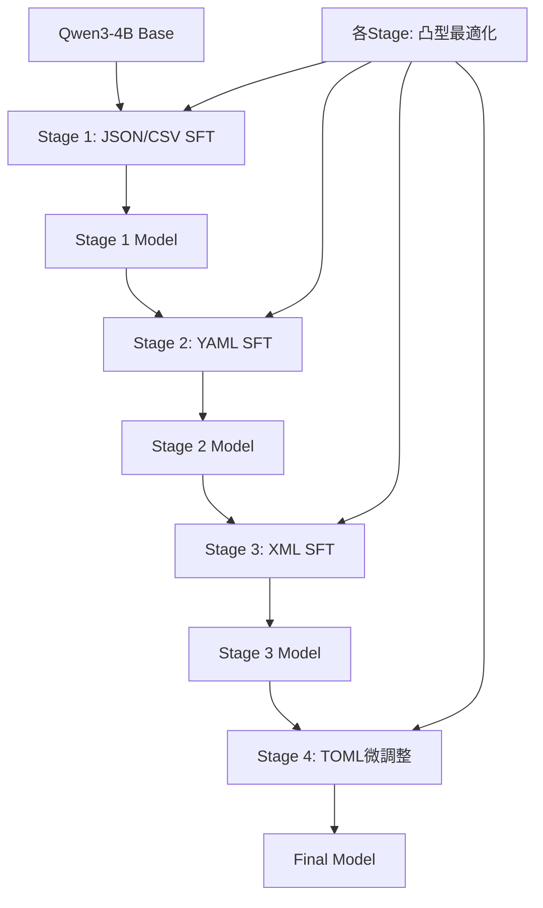

# v8 戦略: 段階的SFT（Sequential Format Learning）による0.8超え

## エグゼクティブサマリー

**目標**: スコア0.8超え達成（Person Uの0.84を目指す）

**核心戦略**: Person Uが発見した「段階的SFT」アプローチを採用
- フォーマットごとに段階的に学習
- 各段階で細かいパラメータの凸型最適化
- データ量より質を重視（Person W: 1000件以下で0.8超え）

---

## 1. Person Q以降の重要知見まとめ

### Person Q: 採点の本質
```
重要ポイント:
- ×判定の多くは「内容が違う」ではなく「形式が壊れた」
- スコアは単純な正解率ではなく「構造の一致度」
- 内容を頑張るより形式ミスを潰す方がスコアに効く
```

### Person R: Empty Think Injection（LB 0.7228）
```
技術的特徴:
- <think></think> を全assistantに付与
- CoT部分を物理削除
- コードフェンス・説明文除去
- データ: 12,686件（u-10bei v4 + daichira hard-4k + Deep Structure Upsampling）
```

### Person T: 衝撃の発見（TOMLの学習源）
```
発見:
- TOMLデータを削除しても、TOMLの正解率は84%を維持
- TOMLの学習はTOMLデータが持つのではなく、他のデータから学習している
- これはデータ選択の根本的な考え方を変える
```

### ⭐ Person U: スコア0.84達成の秘訣
```
達成結果:
- CSV: 100%, JSON: 100%, TOML: 92%, XML: 95%, YAML: 100%

核心的な発見:
1. パラメータ調整で凸型のパターン → 最適点が存在
2. TOMLの学習は想定外のデータで覚えている
3. フォーマットAが良くなってもBが悪くなることがある
4. ベースモデルは特定フォーマットに対して100%の文法正解率を持っている

解決策: 段階的SFT
1. ベースモデルに特定フォーマットのSFT実行
2. そのモデルをベースに別のフォーマットのSFT
3. 細かいパラメータ調整で限界点に到達
```

### Person W: 効率的な学習（0.8超え）
```
ポイント:
- 最終的に1000件以下のデータで学習
- ハイパラの大きな変更より微調整
- epoch2、T4で40分程度
- データの質（今回のコンペに適切か）が重要
```

### Person X: NEFTune導入
```
効果: 一番効いた手法
```

---

## 2. 現状分析

### 2.1 実験結果サマリー（Person Sの分析より）

| バージョン | パース成功率 | JSON | YAML | TOML | XML | CSV |
|-----------|------------|------|------|------|-----|-----|
| **v5.2** | **89.3%** | 98.0% | 88.6% | 72.0% | 85.0% | 95.0% |
| v3 | 89.3% | 98.0% | 97.1% | 64.0% | 85.0% | 90.0% |
| v5 | 87.3% | 98.0% | 100.0% | 52.0% | 85.0% | 85.0% |
| v7.1 | **51.3%** | 72.0% | 54.3% | 12.0% | 30.0% | 65.0% |

### 2.2 v7.1の劣化原因分析
```
v7.1 パース成功率: 51.3%（v5.2の89.3%から大幅劣化）

主なエラーパターン:
- markdown_block: 61件
- natural_language_prefix: 20件
- natural_language_suffix: 17件

原因推定:
- データ追加により学習のバランスが崩れた
- 複数フォーマットを同時に学習することで干渉が発生
```

### 2.3 Person Uとの差分

| 指標 | 現在ベスト(v5.2) | Person U達成値 | Gap |
|------|-----------------|---------------|-----|
| TOML | 72.0% | 92.0% | **+20%** |
| JSON | 98.0% | 100.0% | +2% |
| YAML | 88.6% | 100.0% | **+11.4%** |
| XML | 85.0% | 95.0% | **+10%** |
| CSV | 95.0% | 100.0% | +5% |

**最大の改善余地**: TOML（+20%）、YAML（+11.4%）、XML（+10%）

---

## 3. 新戦略: 段階的SFT（Sequential Format Learning）

### 3.1 基本コンセプト



### 3.2 なぜ段階的SFTが有効か

Person Uの分析に基づく理論:

1. **フォーマット間の干渉防止**
   - 同時に全フォーマットを学習 → 各フォーマットの最適点が異なるため干渉
   - 段階的学習 → 各フォーマットを個別に最適化

2. **ベースモデルの能力を活用**
   - Qwen3-4Bは特定フォーマットに対して既に100%の文法正解率
   - 一度に多くを学習すると、この能力を損なう可能性

3. **TOMLの特殊性**
   - TOMLの学習はTOMLデータ以外から来ている（Person T発見）
   - TOMLは最後に微調整することで、他フォーマットの学習から恩恵を受ける

### 3.3 実装計画

#### Stage 1: JSON/CSV基盤学習
```
目的: 比較的安定しているJSON/CSVを確実に100%にする
データ: JSON/CSVのconversionタスク中心（500〜1000件）
期待結果: JSON 100%, CSV 100%
```

#### Stage 2: YAML強化
```
目的: YAMLを100%に引き上げ
データ: YAML出力タスク + Stage 1モデルをベース
期待結果: YAML 100%維持、JSON/CSVも維持
```

#### Stage 3: XML強化
```
目的: XMLを95%以上に引き上げ
データ: XML出力タスク（&エスケープ含む）
期待結果: XML 95%+, 他フォーマット維持
```

#### Stage 4: TOML最終調整
```
目的: TOMLを90%以上に引き上げ
データ: 複合データ（TOMLは他フォーマットから学習している）
期待結果: TOML 90%+, 全フォーマット最適化
```

---

## 4. 代替戦略: 高品質データ厳選 + NEFTune

### 4.1 Person Wスタイル（1000件以下で0.8超え）

```
コンセプト:
- データ量より質
- 1000件以下の厳選データ
- epoch2、ハイパラ微調整

データ選択基準:
1. パース100%成功するデータのみ
2. conversionタスク中心（generationより難しい）
3. 複雑な構造（depth >= 3）を含む
```

### 4.2 NEFTune導入（Person X）

```python
# training_argumentsに追加
neftune_noise_alpha=5,  # 典型的な値: 5-15
```

---

## 5. 具体的実装プラン

### Phase 1: データ準備（1日目）

#### 5.1.1 フォーマット別データセット作成

```python
# scripts/create_format_specific_datasets.py

# 目的: 各フォーマット専用の高品質データセットを作成

# Stage 1用: JSON/CSV
# - 出力がJSON/CSVのタスクのみ抽出
# - パース100%成功のもののみ
# - 500〜1000件

# Stage 2用: YAML
# - 出力がYAMLのタスクのみ
# - depth >= 3の複雑なものを優先
# - 300〜500件

# Stage 3用: XML
# - 出力がXMLのタスクのみ
# - &エスケープを含むものを追加
# - 300〜500件

# Stage 4用: 複合
# - 全フォーマット混合
# - Person T発見: TOMLは他フォーマットから学習
# - 500〜1000件
```

#### 5.1.2 高品質データ厳選（Person Wスタイル）

```python
# scripts/create_curated_1k_dataset.py

# 基準:
# 1. パース成功率100%
# 2. コードフェンス混入なし
# 3. 説明文混入なし
# 4. 適切な複雑さ（極端に単純/複雑でない）

# 目標: 1000件以下の最高品質データ
```

### Phase 2: 段階的SFT実験（2-3日目）

#### 5.2.1 Stage 1: JSON/CSV基盤

```python
# notebooks/SFT/v8_stage1_json_csv.ipynb

# 設定
os.environ["SFT_DATASET_ID"] = "path/to/stage1_json_csv"
os.environ["SFT_MAX_SEQ_LEN"] = "1024"
os.environ["SFT_EPOCHS"] = "2"
os.environ["SFT_LR"] = "5e-5"

# 評価: JSON/CSV それぞれ100%が目標
```

#### 5.2.2 Stage 2-4: 継続学習

```python
# Stage 2: Stage 1モデルをベースにYAML学習
os.environ["SFT_BASE_MODEL"] = "your-hf-repo/stage1-model"

# Stage 3: Stage 2モデルをベースにXML学習
os.environ["SFT_BASE_MODEL"] = "your-hf-repo/stage2-model"

# Stage 4: Stage 3モデルをベースに複合学習
os.environ["SFT_BASE_MODEL"] = "your-hf-repo/stage3-model"
```

### Phase 3: 凸型最適化（各Stage）

```
各Stageで実施:
1. lr = [1e-5, 3e-5, 5e-5, 8e-5, 1e-4] で実験
2. 文法チェックツールで評価
3. 凸型のピーク（最適点）を特定
4. 最適設定で本番学習
```

### Phase 4: 最終調整（4日目）

```
1. 全Stage完了後の評価
2. 弱点フォーマットの追加学習
3. NEFTune導入検討
4. LB提出
```

---

## 6. 評価指標と成功基準

### 6.1 ローカル評価（提出前）

```
フォーマット別パース成功率:
- JSON: 100% 必達
- CSV: 100% 必達
- YAML: 95%以上
- XML: 90%以上
- TOML: 85%以上

エラーパターン:
- markdown_block: 0件
- natural_language_prefix: 0件
- natural_language_suffix: 0件
```

### 6.2 LB目標

| マイルストーン | スコア | 達成条件 |
|--------------|--------|---------|
| M1 | 0.78 | v5.2超え |
| M2 | 0.80 | 80%ライン |
| **M3** | **0.84** | Person Uレベル |

---

## 7. リスクと対策

### 7.1 段階的SFTのリスク

| リスク | 影響 | 対策 |
|-------|------|------|
| 各Stageで時間がかかる | 高 | L4 GPU使用、並行実験不可なので優先順位付け |
| 後段のSFTで前段の学習が崩れる | 高 | 各Stage後にフル評価、問題あれば巻き戻し |
| 提出回数制限（50回） | 中 | ローカル評価で事前スクリーニング |

### 7.2 代替プランへのフォールバック

```
段階的SFTがうまくいかない場合:
→ Person Wスタイル（1000件以下厳選 + 微調整）にシフト
→ NEFTune単独導入
→ v5.2 + ハイパラ微調整
```

---

## 8. 実験スケジュール

| 日 | 作業内容 | 成果物 |
|----|---------|--------|
| Day 1 | データ準備・スクリプト作成 | format_specific_datasets, curated_1k_dataset |
| Day 2 | Stage 1-2 実験 | stage1_model, stage2_model |
| Day 3 | Stage 3-4 実験 | stage3_model, stage4_model |
| Day 4 | 最終調整・LB提出 | 0.8+スコア達成 |

---

## 9. 次のアクション

1. [ ] `scripts/create_format_specific_datasets.py` 作成
2. [ ] `scripts/create_curated_1k_dataset.py` 作成
3. [ ] Stage 1 ノートブック作成（JSON/CSV）
4. [ ] ローカル評価スクリプトの整備
5. [ ] Stage 1 実験実行
6. [ ] 結果に基づいて次Stageへ

---

## 付録: 重要な技術的詳細

### A. HuggingFaceへのマージモデルアップロード（Person H）

```python
# Stage間でモデルを継承するために必要
# LoRAをベースにマージしてアップロード

from unsloth import FastLanguageModel
from peft import PeftModel

# ベースモデルロード
base_model, tokenizer = FastLanguageModel.from_pretrained(
    model_name=BASE_MODEL_ID,
    max_seq_length=MAX_SEQ_LEN,
    dtype=torch.bfloat16,
    load_in_4bit=False,
)

# LoRAマージ
model = PeftModel.from_pretrained(base_model, str(LORA_SAVE_DIR))
model = model.merge_and_unload()

# 保存・アップロード
model.save_pretrained(str(STAGE_DIR), safe_serialization=True)
tokenizer.save_pretrained(str(STAGE_DIR))
```

### B. NEFTune設定

```python
from transformers import TrainingArguments

training_args = TrainingArguments(
    # ... 他の設定
    neftune_noise_alpha=5,  # 5-15が典型的
)
```

### C. 文法チェックツール（Person Kベース）

```python
# scripts/local_eval.py を使用
# フォーマット別のパース成功率を事前確認
```
